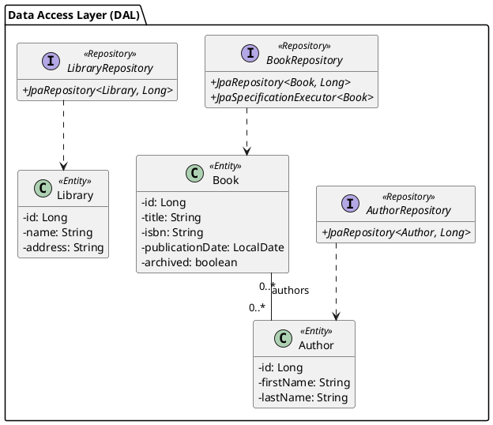

# Chapitre 1 : Introduction et Présentation du Projet Fil Rouge

### Objectifs Pédagogiques

À la fin de ce chapitre, vous serez capable de :

- Comprendre la finalité et la structure de ce cours.
- Décrire le rôle d'une API REST dans une architecture applicative moderne.
- Mettre en place un projet Spring Boot complet avec ses dépendances.
- Comprendre le modèle de données du projet "fil rouge" que nous utiliserons.
- Lancer l'application et vérifier que la base de données est correctement initialisée.

### Introduction : L'architecte du monde numérique

Imaginez que vous êtes un architecte. Pas un architecte de bâtiments, mais un architecte d'applications. Vous devez
concevoir un système complexe : une application web pour les utilisateurs, une application mobile pour les nomades, et
peut-être même une interface pour des partenaires externes. Comment faites-vous pour que tous ces "bâtiments" (vos
applications clientes) communiquent de manière cohérente avec la "centrale" (votre logique métier et vos données) ?

La réponse est : **en construisant des ponts**. Dans le monde du développement, ces ponts sont les **API** (Application
Programming Interfaces). Une API REST est un style d'architecture pour construire ces ponts de manière standardisée,
simple et efficace. C'est la lingua franca du web moderne.

Dans ce cours, nous n'allons pas seulement parler de la théorie. Nous allons enfiler notre casque de chantier et
construire notre propre API pour un projet concret : **BiblioTech**, un système de gestion de bibliothèques. C'est
parti !

### Le Projet Fil Rouge : "BiblioTech"

Tout au long de ce cours, nous allons développer l'API d'un système de gestion de bibliothèques que nous appellerons "
BiblioTech".

Le contexte est le suivant :

- Des **auteurs** écrivent des **livres**.
- Les **livres** sont disponibles dans différentes **bibliothèques**.
- Un livre peut avoir plusieurs auteurs, et un auteur peut écrire plusieurs livres.
- Un livre peut être présent dans plusieurs bibliothèques, et une bibliothèque contient de nombreux livres.

Cela nous donne un modèle de données riche avec des relations intéressantes à manipuler.

#### 1. Mise en Place de l'Environnement

[Lien vers le projet sur GitHub](https://github.com/smaloron/spring-rest-biblio-tech)

```shell
git clone https://github.com/smaloron/spring-rest-biblio-tech biblioTech
```


#### 2. Structure du projet




### Exercice 1 : Lancement et Vérification du Projet

Votre première mission, si vous l'acceptez : lancer le projet et vérifier que tout est en ordre.

**Énoncé :**

1. Assurez-vous d'avoir un JDK 17 (ou supérieur) et Maven installés sur votre machine.
2. Clonez le projet avec Git.
3. Lancez la classe principale de l'application (celle annotée avec `@SpringBootApplication`) ou utilisez la 
   commande console `mvn spring-boot:run`.
4. Ouvrez votre navigateur web et accédez à l'URL de la console H2 : `http://localhost:8080/h2-console`.
5. Dans le champ `JDBC URL`, assurez-vous que la valeur est `jdbc:h2:mem:bibliotechdb`.
6. Connectez-vous et vérifiez que les tables (`AUTHOR`, `BOOK`, `LIBRARY`, `BOOK_AUTHOR`) ont été créées et qu'elles
   contiennent les données que nous avons définies dans `FixturesLoader`.

### Correction exercice 1 {collapsible="true"}

Si tout s'est bien passé, voici ce que vous devriez observer :

1. **Console de l'IDE :** Au démarrage, vous devriez voir les logs de Spring Boot, y compris les requêtes SQL
   `CREATE TABLE` et `INSERT INTO` générées par Hibernate, car nous avons activé `spring.jpa.show-sql=true`.

   ```text
   ...
   Hibernate: create table author (id bigint generated by default as identity, first_name varchar(255), last_name varchar(255), primary key (id))
   Hibernate: create table book (publication_date date, id bigint generated by default as identity, isbn varchar(255) unique, title varchar(255), primary key (id))
   ...
   Hibernate: insert into author (first_name, last_name) values (?, ?)
   ...
   ```

2. **Console H2 :** Après vous être connecté avec les bons paramètres (`JDBC URL: jdbc:h2:mem:bibliotechdb`,
   `User Name: sa`, `Password: `), vous verrez la liste des tables sur la gauche.


3. **Vérification des données :** Vous pouvez exécuter des requêtes SQL pour vérifier le contenu des tables.
    - `SELECT * FROM AUTHOR;` devrait retourner J.K. Rowling et J.R.R. Tolkien.
    - `SELECT * FROM BOOK;` devrait retourner les deux livres.
    - `SELECT * FROM BOOK_AUTHOR;` devrait montrer les associations entre les livres et les auteurs.

<note title="Bravo !">
<p>Félicitations ! Vous venez de monter un projet Spring Boot complet, avec une base de données fonctionnelle et des données de test. C'est la fondation sur laquelle nous allons construire toute notre API. Vous êtes officiellement prêt à passer à la suite !</p>
</note>

### Auto-évaluation

Testez vos connaissances avec ces quelques questions.

1. **(QCM)** Quel est le rôle principal du fichier `pom.xml` dans notre projet ?
   a) Définir la structure de la base de données.
   b) Gérer les dépendances du projet et sa construction.
   c) Écrire le code métier de l'application.
   d) Configurer les ports réseau.

2. **_ (Question ouverte)_** À quoi sert l'annotation `@Entity` sur une classe Java dans le contexte de JPA ?

3. **(QCM)** Quelle dépendance nous fournit une base de données en mémoire pour faciliter le développement ?
   a) `spring-boot-starter-web`
   b) `h2`
   c) `lombok`
   d) `spring-boot-starter-data-jpa`

4. **_ (Question ouverte)_** Expliquez en une phrase le rôle de l'interface `CommandLineRunner` dans notre projet.

5. **_ (Question ouverte)_** Qu'est-ce que l'annotation `@ManyToMany` indique et pourquoi est-elle utilisée entre `Book`
   et `Author` ?

### Conclusion

Dans ce premier chapitre, nous avons posé des fondations solides. Nous avons découvert l'objectif du cours et le
contexte de notre projet fil rouge, "BiblioTech". Plus important encore, nous avons mis en place un environnement de
développement Spring Boot complet, fonctionnel et prêt à l'emploi. 

Maintenant que la scène est prête et que les acteurs (nos données) sont en place, il est temps de lever le rideau et de
commencer à construire le spectacle : notre API REST. 