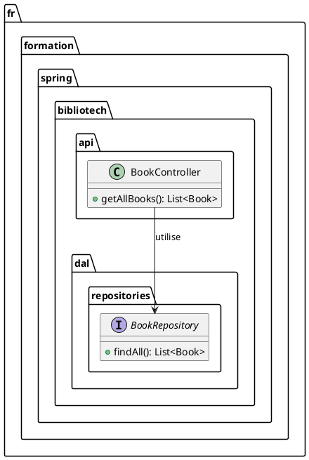

# Chapitre 2 : Les Fondamentaux de REST - L'Essentiel

Maintenant que notre projet "BiblioTech" est sur les rails, il est temps de comprendre les plans de l'architecte. Ces
plans, c'est l'architecture REST. Nous allons découvrir ses principes fondamentaux et, surtout, nous allons écrire nos
premières lignes de code pour exposer nos données au monde extérieur.

### Objectifs Pédagogiques

À la fin de cette partie, vous serez capable de :

- Définir ce qu'est une API REST et ses principes clés.
- Comprendre la notion de "ressource" et son identification via une URI.
- Connaître les principaux verbes HTTP (GET, POST, PUT, DELETE) et leur sémantique.
- Créer votre premier contrôleur Spring Boot pour exposer des données.
- Implémenter un endpoint `GET` pour récupérer une liste de ressources.
- Tester cet endpoint avec un client HTTP.

### Introduction : Le Code de la Route du Web

Imaginez un instant un monde sans code de la route. Ce serait le chaos, n'est-ce pas ? Chacun conduirait comme bon lui
semble, rendant les déplacements imprévisibles et dangereux.

Une API REST, c'est un peu le **code de la route de la communication entre applications**. Ce n'est pas une technologie
ou un langage, mais un ensemble de règles et de bonnes pratiques (un "style architectural") qui garantit que tout le
monde se comprend. Quand un client (une application mobile, un site web) "parle" à un serveur (notre application Spring
Boot), ils suivent ces règles. Le résultat ? Une communication fluide, prévisible et standardisée.

C'est grâce à ces règles que votre application mobile bancaire peut interroger votre solde, que votre application météo
peut récupérer les prévisions, et que notre future application "BiblioTech" pourra lister tous les livres disponibles.

### Qu'est-ce que REST ?

REST est l'acronyme de **RE**presentational **S**tate **T**ransfer. Décortiquons cela :

- **Resource (Ressource)** : C'est le concept central. Dans notre projet, un livre, un auteur, une bibliothèque sont des
  ressources. C'est un objet ou une donnée suffisamment importante pour qu'on lui donne une "adresse". Cette adresse est
  une **URI** (Uniform Resource Identifier). Par exemple, `/api/books/1` pourrait être l'URI du livre avec l'ID 1.

- **Representational (Représentation)** : Lorsque vous demandez une ressource au serveur, il ne vous envoie pas l'objet
  Java ou la ligne de la base de données. Il vous envoie une **représentation** de cette ressource, généralement au
  format **JSON** (JavaScript Object Notation) ou XML. C'est une description textuelle de l'état de la ressource à un
  instant T.

- **State Transfer (Transfert d'État)** : C'est l'action de transférer la représentation de l'état d'une ressource du
  serveur vers le client (ou inversement).

En résumé, un client demande au serveur l'état d'une ressource via son URI, et le serveur lui renvoie une représentation
de cet état.

#### Les Piliers de l'Architecture REST

Pour qu'une API soit considérée comme "RESTful", elle doit respecter plusieurs contraintes. La plus importante pour nous
au début est :

**L'absence d'état (Stateless)** : Le serveur ne conserve aucune information sur le client entre deux requêtes. Chaque
requête envoyée par le client doit contenir toutes les informations nécessaires pour que le serveur la comprenne et la
traite. C'est comme parler à quelqu'un qui a une mémoire à très court terme : vous devez vous représenter à chaque
phrase. Cela rend l'application beaucoup plus simple à faire évoluer et à distribuer sur plusieurs serveurs (
scalabilité).

#### Les Verbes HTTP : Le Langage de l'Action

Pour interagir avec les ressources, REST s'appuie sur le protocole HTTP et ses "verbes" (ou méthodes). Chaque verbe a
une signification précise.

| Verbe HTTP | Action CRUD | Description                                              |
|:-----------|:------------|:---------------------------------------------------------|
| **GET**    | **R**ead    | Récupérer une ressource ou une collection de ressources. |
| **POST**   | **C**reate  | Créer une nouvelle ressource.                            |
| **PUT**    | **U**pdate  | Mettre à jour intégralement une ressource existante.     |
| **DELETE** | **D**elete  | Supprimer une ressource.                                 |
| **PATCH**  | **U**pdate  | Mettre à jour partiellement une ressource existante.     |

<tip title="Idempotence et Sécurité">
<p>Deux concepts importants :</p>
<ul>
<li>Une opération est <b>sûre (safe)</b> si elle ne modifie pas l'état du serveur. <b>GET</b> est une méthode sûre.</li>
<li>Une opération est <b>idempotente</b> si la répéter plusieurs fois produit le même effet que de l'appeler une seule 
fois. <b>GET</b>, <b>PUT</b> et <b>DELETE</b> sont idempotentes. <b>POST</b> ne l'est pas (chaque appel crée une nouvelle ressource).</li>
</ul>
</tip>

### Créer notre Premier Contrôleur

Assez de théorie, passons à la pratique ! Nous allons créer un "endpoint" (un point de terminaison de l'API) qui
retournera la liste de tous les livres de notre bibliothèque.

Pour cela, nous créons une classe spéciale : un **Contrôleur**.

<procedure title="Création du BookController">

1. Créez un nouveau package `fr.formation.spring.bibliotech.api`.
2. À l'intérieur, créez une classe `BookController.java`.

```java
// package fr.formation.spring.bibliotech.api;

import fr.formation.spring.bibliotech.dal.entities.Book;
import fr.formation.spring.bibliotech.dal.repositories.BookRepository;
import org.springframework.web.bind.annotation.GetMapping;
import org.springframework.web.bind.annotation.RequestMapping;
import org.springframework.web.bind.annotation.RestController;

import java.util.List;

// @RestController combine @Controller et @ResponseBody.
// Il indique que cette classe gère des requêtes web et que les 
// retours de méthodes seront directement écrits dans la réponse HTTP.
@RestController
// @RequestMapping définit l'URI de base pour toutes les méthodes 
// de ce contrôleur.
@RequestMapping("/api/books")
public class BookController {

    private final BookRepository bookRepository;

    // Injection de dépendance du repository pour accéder aux données.
    public BookController(BookRepository bookRepository) {
        this.bookRepository = bookRepository;
    }

    // @GetMapping indique que cette méthode répond aux requêtes HTTP GET.
    // L'URL complète sera donc : GET /api/books
    @GetMapping
    public List<Book> getAllBooks() {
        // Spring Data JPA nous offre findAll() pour récupérer tous les 
        // enregistrements.
        return this.bookRepository.findAll();
    }
}
```



</procedure>

<note class="alert alert-success" title="Magie de Spring Boot !">
<p>Vous avez remarqué ? Nous retournons une <code>List&lt;Book&gt;</code>, un objet Java. Spring Boot, grâce à la dépendance <b>spring-boot-starter-web</b>, détecte la présence de la librairie <b>Jackson</b> et convertit automatiquement notre liste d'objets Java en une chaîne de caractères au format JSON !</p>
</note>

### Tester notre Endpoint

Maintenant que notre endpoint est créé, comment savoir s'il fonctionne ?

Relancez votre application, puis utilisez un client HTTP pour envoyer une requête. Si vous utilisez IntelliJ IDEA
Ultimate, vous pouvez utiliser le client HTTP intégré.

<procedure title="Requête HTTP avec IntelliJ">

1. Créez un nouveau fichier dans votre projet, par exemple `requests.http`.
2. Ajoutez le code suivant :

```http
### Récupérer tous les livres
GET http://localhost:8080/api/books
Accept: application/json
```

3. Cliquez sur la petite icône de lecture verte à côté de la requête pour l'exécuter.

Vous devriez recevoir une réponse avec un code `200 OK` et un corps de réponse (body) contenant la liste de vos livres
au format JSON :

```json
[
  {
    "id": 1,
    "title": "Harry Potter and the Sorcerer's Stone",
    "isbn": "978-0439708180",
    "publicationDate": "1997-06-26",
    "authors": [
      {
        "id": 1,
        "firstName": "J.K.",
        "lastName": "Rowling",
        "books": []
      }
    ]
  },
  {
    "id": 2,
    "title": "The Hobbit",
    "isbn": "978-0345339683",
    "publicationDate": "1937-09-21",
    "authors": [
      {
        "id": 2,
        "firstName": "J.R.R.",
        "lastName": "Tolkien",
        "books": []
      }
    ]
  }
]
```

</procedure>
<warning class="alert alert-warning" title="Boucles infinies en JSON">
<p>Avez-vous remarqué que dans la réponse, la propriété <code>books</code> de l'auteur est vide ? Si elle n'était pas vide, Jackson essaierait de sérialiser les livres de l'auteur, qui eux-mêmes contiennent l'auteur, qui contient ses livres, etc. C'est une <b>boucle infinie</b> ! Nous apprendrons à gérer cela proprement avec les DTO (Data Transfer Objects) dans un prochain chapitre.</p>
</warning>

### Exercice 2 : Créer l'Endpoint pour les Auteurs

C'est à votre tour de jouer ! Mettez en pratique ce que vous venez d'apprendre.

**Énoncé :**

1. Créez une nouvelle classe `AuthorController` dans le package `fr.formation.spring.bibliotech.api`.
2. Configurez ce contrôleur pour qu'il réponde à l'URI de base `/api/authors`.
3. Injectez le `AuthorRepository`.
4. Implémentez une méthode qui répond aux requêtes `GET` sur `/api/authors` et qui retourne la liste de tous les auteurs
   de la base de données.
5. Testez votre nouvel endpoint avec une requête HTTP et vérifiez que vous recevez bien la liste des auteurs au format
   JSON.

### Correction exercice 2 {collapsible="true"}

Voici la solution pour l'exercice.

1. **Le contrôleur `AuthorController.java` :**

```java
// package fr.formation.spring.bibliotech.api;

import fr.formation.spring.bibliotech.dal.entities.Author;
import fr.formation.spring.bibliotech.dal.repositories.AuthorRepository;
import org.springframework.web.bind.annotation.GetMapping;
import org.springframework.web.bind.annotation.RequestMapping;
import org.springframework.web.bind.annotation.RestController;

import java.util.List;

@RestController
@RequestMapping("/api/authors")
public class AuthorController {

    private final AuthorRepository authorRepository;

    public AuthorController(AuthorRepository authorRepository) {
        this.authorRepository = authorRepository;
    }

    @GetMapping
    public List<Author> getAllAuthors() {
        return this.authorRepository.findAll();
    }
}
```

2. **La requête de test `requests.http` :**

```http
### Récupérer tous les auteurs
GET http://localhost:8080/api/authors
Accept: application/json
```

3. **La réponse attendue (JSON) :**

```json
[
  {
    "id": 1,
    "firstName": "J.K.",
    "lastName": "Rowling",
    "books": [
      {
        "id": 1,
        "title": "Harry Potter and the Sorcerer's Stone",
        "isbn": "978-0439708180",
        "publicationDate": "1997-06-26",
        "authors": []
      }
    ]
  },
  {
    "id": 2,
    "firstName": "J.R.R.",
    "lastName": "Tolkien",
    "books": [
      {
        "id": 2,
        "title": "The Hobbit",
        "isbn": "978-0345339683",
        "publicationDate": "1937-09-21",
        "authors": []
      }
    ]
  }
]
```

Vous avez réussi ? Excellent travail ! Vous maîtrisez maintenant la création d'endpoints de lecture.

### Auto-évaluation

1. **(QCM)** Que signifie l'acronyme REST ?
   a) Remote Execution State Transfer
   b) Representational State Transfer
   c) Resource Standard Template
   d) Representational Standard Type

2. **_ (Question ouverte)_** Qu'est-ce qu'une "ressource" dans une API REST ? Donnez un exemple tiré de notre projet "
   BiblioTech".

3. **(QCM)** Quelle annotation Spring Boot est utilisée pour mapper une méthode de contrôleur à une requête HTTP GET ?
   a) `@Request`
   b) `@Get`
   c) `@GetMapping`
   d) `@Controller`

4. **_ (Question ouverte)_** Expliquez le principe "Stateless" (sans état) en une ou deux phrases. Pourquoi est-ce un
   avantage ?

5. **_ (Question ouverte)_** Si vous vouliez créer un endpoint pour lister toutes les bibliothèques, quelle URI de base
   choisiriez-vous pour le contrôleur, en suivant les conventions REST ?

### Conclusion

Félicitations ! Vous avez fait un grand pas en avant. Vous êtes passé de la théorie abstraite de REST à la pratique
concrète en créant vos premiers endpoints. Vous savez maintenant comment :

- Structurer un contrôleur REST dans Spring Boot.
- Utiliser les annotations `@RestController`, `@RequestMapping`, et `@GetMapping`.
- Exposer des données via une API en retournant simplement des objets Java.
- Tester vos créations.

Vous avez ouvert la première porte de communication de votre application. Mais une API ne sert pas qu'à lire des
données. Dans la partie suivante, "Pour aller plus loin", nous verrons comment rendre notre API interactive : créer,
mettre à jour et supprimer des ressources. Nous allons donner vie à notre API 