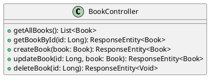

# Chapitre 2 : Interagir avec les Ressources - Pour aller plus loin

Dans la première partie, nous avons ouvert une "vitrine" sur nos données en permettant de les lister. C'est un excellent
début, mais une véritable application a besoin d'interactivité. Comment ajouter un nouveau livre à notre catalogue ?
Corriger une coquille dans un titre ? Retirer un livre perdu ? C'est ce que nous allons découvrir maintenant en
explorant les autres verbes HTTP.

### Objectifs Pédagogiques

À la fin de cette partie, vous serez capable de :

- Implémenter des endpoints pour les opérations CRUD complètes (Create, Read, Update, Delete).
- Récupérer une ressource unique par son identifiant avec `@PathVariable`.
- Accepter des données du client dans le corps d'une requête avec `@RequestBody`.
- Maîtriser l'utilisation de `ResponseEntity` pour contrôler finement les réponses HTTP (status, headers, body).
- Utiliser les codes de statut HTTP sémantiques (200, 201, 204, 404).

### Introduction : De spectateur à acteur

Jusqu'à présent, notre API se comportait comme un catalogue de bibliothèque : on peut le consulter (`GET` /api/books),
mais on ne peut pas interagir avec. Il est temps de donner des super-pouvoirs à nos utilisateurs (ou du moins, aux
applications qui les représentent). Nous allons leur permettre de devenir des acteurs : ajouter des livres, les
modifier, et même les retirer des étagères.

Pour chaque action, nous utiliserons l'outil approprié de la boîte à outils HTTP : un verbe spécifique, une URI claire
et un code de statut qui confirme si l'opération a réussi. En route pour une API vivante !

### Les Opérations CRUD en Détail

Complétons notre `BookController` pour gérer le cycle de vie complet d'un livre.

#### 1. Récupérer UN livre par son ID (Read)

Pour consulter un livre spécifique, nous avons besoin de son identifiant. La convention REST est de placer cet
identifiant directement dans l'URL.

**Exemple d'URI :** `GET /api/books/1`

Pour extraire la valeur `1` de l'URL, Spring nous fournit l'annotation `@PathVariable`.

<procedure title="Implémentation de `getBookById`">

```java
// Dans la classe BookController.java

import org.springframework.http.ResponseEntity;
import org.springframework.web.bind.annotation.PathVariable;

import java.util.Optional;

// ... (dans la classe BookController)

// @GetMapping("/{id}") complète l'URI de base "/api/books".

// L'URL sera donc /api/books/{id}, où {id} est une variable.
@GetMapping("/{id}")
public ResponseEntity<Book> getBookById(@PathVariable Long id) {
    // @PathVariable lie la variable "id" de l'URL au paramètre "id" 
    // de la méthode.

    // findById retourne un Optional<Book>, qui est un conteneur
    // pouvant contenir ou non une valeur. C'est une façon propre de
    // gérer les cas où le livre n'est pas trouvé.
    Optional<Book> book = this.bookRepository.findById(id);

    if (book.isPresent()) {
        // Si le livre existe, on retourne un statut 200 OK
        // et le livre dans le corps de la réponse.
        return ResponseEntity.ok(book.get());
    } else {
        // Si le livre n'existe pas, on retourne un statut 404 Not Found.
        // .build() crée une réponse sans corps.
        return ResponseEntity.notFound().build();
    }
}
```

</procedure>

<note title="ResponseEntity, votre couteau suisse">

Pourquoi utiliser <code>ResponseEntity</code> au lieu de retourner directement <code>Book</code> ? 
Car cela nous donne un contrôle total sur la réponse HTTP. Nous pouvons définir :
- Le <b>code de statut</b> (200, 404, etc.)
- Les <b>en-têtes HTTP</b> (headers)
- Le <b>corps de la réponse</b> (body)

C'est la manière la plus professionnelle et flexible de construire des réponses d'API.
</note>


#### 2. Créer un nouveau livre (Create)

Pour créer un livre, le client doit nous envoyer ses informations (titre, ISBN, etc.). Ces données voyagent dans le *
*corps (body)** de la requête HTTP, généralement au format JSON. Nous utilisons le verbe `POST`.

**Exemple de requête :** `POST /api/books` avec un corps JSON.

Pour lire ce corps de requête et le transformer en objet Java, nous utilisons l'annotation `@RequestBody`.

<procedure title="Implémentation de `createBook`">

```java
// Dans la classe BookController.java

import org.springframework.web.bind.annotation.PostMapping;
import org.springframework.web.bind.annotation.RequestBody;
import org.springframework.web.servlet.support.ServletUriComponentsBuilder;

import java.net.URI;

// ... (dans la classe BookController)

// @PostMapping mappe cette méthode aux requêtes POST sur /api/books

@PostMapping
public ResponseEntity<Book> createBook(@RequestBody Book bookToCreate) {
    // @RequestBody dit à Spring de convertir le JSON du corps de la
    // requête en un objet Book.

    Book savedBook = this.bookRepository.save(bookToCreate);

    // Bonne pratique REST : lors d'une création (POST), on retourne
    // un statut 201 Created. On fournit aussi dans l'en-tête "Location"
    // l'URL pour accéder à la nouvelle ressource.
    URI location = ServletUriComponentsBuilder
            .fromCurrentRequest() // Prend l'URL de la requête actuelle (/api/books)
            .path("/{id}")        // Ajoute /{id}
            .buildAndExpand(savedBook.getId()) // Remplace {id} par l'ID du livre créé
            .toUri();

    return ResponseEntity.created(location).body(savedBook);
}
```

</procedure>

#### 3. Mettre à jour un livre (Update)

La mise à jour se fait avec le verbe `PUT`. Le client envoie une représentation **complète** de la ressource à l'URL de
cette ressource.

**Exemple de requête :** `PUT /api/books/1` avec un corps JSON.

<procedure title="Implémentation de `updateBook`">

```java
// Dans la classe BookController.java

import org.springframework.web.bind.annotation.PutMapping;

// ... (dans la classe BookController)

@PutMapping("/{id}")
public ResponseEntity<Book> updateBook(@PathVariable Long id,
                                       @RequestBody Book bookDetails) {
    // On vérifie d'abord si le livre à mettre à jour existe.
    return this.bookRepository.findById(id)
            .map(bookToUpdate -> {
                // Si le livre existe, on met à jour ses champs.
                bookToUpdate.setTitle(bookDetails.getTitle());
                bookToUpdate.setIsbn(bookDetails.getIsbn());
                bookToUpdate.setPublicationDate(bookDetails.getPublicationDate());
                bookToUpdate.setAuthors(bookDetails.getAuthors());

                Book updatedBook = this.bookRepository.save(bookToUpdate);

                // On retourne un 200 OK avec le livre mis à jour.
                return ResponseEntity.ok(updatedBook);
            })
            .orElse(ResponseEntity.notFound().build()); // Sinon, 404 Not Found.
}
```

</procedure>

#### 4. Supprimer un livre (Delete)

La suppression est une action directe sur une ressource identifiée. On utilise le verbe `DELETE`.

**Exemple de requête :** `DELETE /api/books/1`

<procedure title="Implémentation de `deleteBook`">

```java
// Dans la classe BookController.java

import org.springframework.web.bind.annotation.DeleteMapping;

// ... (dans la classe BookController)

@DeleteMapping("/{id}")
public ResponseEntity<Void> deleteBook(@PathVariable Long id) {
    // On vérifie que le livre existe avant de tenter de le supprimer.
    if (bookRepository.existsById(id)) {
        this.bookRepository.deleteById(id);

        // Bonne pratique REST : une suppression réussie retourne
        // un statut 204 No Content. Il n'y a rien à renvoyer dans le corps.
        return ResponseEntity.noContent().build();
    } else {
        return ResponseEntity.notFound().build();
    }
}
```

</procedure>



### Exercice 3 : Compléter le CRUD pour les Auteurs

Vous avez vu comment faire pour les livres, à vous de jouer pour les auteurs !

**Énoncé :**
Reprenez votre `AuthorController` de l'exercice précédent et ajoutez-y les méthodes pour :

1. **Récupérer un auteur par son ID.**
    - Verbe : `GET`
    - URI : `/api/authors/{id}`
    - Réponse succès : `200 OK` avec l'auteur.
    - Réponse erreur : `404 Not Found` si l'auteur n'existe pas.
2. **Créer un nouvel auteur.**
    - Verbe : `POST`
    - URI : `/api/authors`
    - Réponse succès : `201 Created` avec l'auteur créé et l'en-tête `Location`.
3. **Mettre à jour un auteur existant.**
    - Verbe : `PUT`
    - URI : `/api/authors/{id}`
    - Réponse succès : `200 OK` avec l'auteur mis à jour.
    - Réponse erreur : `404 Not Found`.
4. **Supprimer un auteur.**
    - Verbe : `DELETE`
    - URI : `/api/authors/{id}`
    - Réponse succès : `204 No Content`.
    - Réponse erreur : `404 Not Found`.

Testez chaque endpoint avec votre client HTTP.

### Correction exercice 3 {collapsible="true"}

Voici la solution complète pour le `AuthorController`.

**`AuthorController.java`**

```java
package fr.formation.spring.bibliotech.api;

import fr.formation.spring.bibliotech.dal.entities.Author;
import fr.formation.spring.bibliotech.dal.repositories.AuthorRepository;
import org.springframework.http.ResponseEntity;
import org.springframework.web.bind.annotation.*;
import org.springframework.web.servlet.support.ServletUriComponentsBuilder;

import java.net.URI;
import java.util.List;

@RestController
@RequestMapping("/api/authors")
public class AuthorController {

    private final AuthorRepository authorRepository;

    public AuthorController(AuthorRepository authorRepository) {
        this.authorRepository = authorRepository;
    }

    // GET All (déjà fait)
    @GetMapping
    public List<Author> getAllAuthors() {
        return this.authorRepository.findAll();
    }

    // 1. GET by ID
    @GetMapping("/{id}")
    public ResponseEntity<Author> getAuthorById(@PathVariable Long id) {
        return this.authorRepository.findById(id)
                .map(ResponseEntity::ok)
                .orElse(ResponseEntity.notFound().build());
    }

    // 2. POST (Create)
    @PostMapping
    public ResponseEntity<Author> createAuthor(@RequestBody Author author) {
        Author savedAuthor = this.authorRepository.save(author);
        URI location = ServletUriComponentsBuilder
                .fromCurrentRequest().path("/{id}")
                .buildAndExpand(savedAuthor.getId()).toUri();
        return ResponseEntity.created(location).body(savedAuthor);
    }

    // 3. PUT (Update)
    @PutMapping("/{id}")
    public ResponseEntity<Author> updateAuthor(@PathVariable Long id,
                                               @RequestBody Author authorDetails) {
        return this.authorRepository.findById(id)
                .map(author -> {
                    author.setFirstName(authorDetails.getFirstName());
                    author.setLastName(authorDetails.getLastName());
                    Author updatedAuthor = this.authorRepository.save(author);
                    return ResponseEntity.ok(updatedAuthor);
                })
                .orElse(ResponseEntity.notFound().build());
    }

    // 4. DELETE
    @DeleteMapping("/{id}")
    public ResponseEntity<Void> deleteAuthor(@PathVariable Long id) {
        if (authorRepository.existsById(id)) {
            authorRepository.deleteById(id);
            return ResponseEntity.noContent().build();
        }
        return ResponseEntity.notFound().build();
    }
}
```

**Fichier de requêtes `requests.http` pour tester**

```http
### 1. Récupérer l'auteur avec l'ID 1
GET http://localhost:8080/api/authors/1

### 1b. Récupérer un auteur qui n'existe pas (doit retourner 404)
GET http://localhost:8080/api/authors/999

### 2. Créer un nouvel auteur
POST http://localhost:8080/api/authors
Content-Type: application/json

{
  "firstName": "George",
  "lastName": "Orwell"
}

### 3. Mettre à jour l'auteur avec l'ID 1
PUT http://localhost:8080/api/authors/1
Content-Type: application/json

{
  "firstName": "Joanne",
  "lastName": "Rowling"
}

### 4. Supprimer l'auteur avec l'ID 2
DELETE http://localhost:8080/api/authors/2

### 4b. Tenter de supprimer un auteur qui n'existe plus (doit retourner 404)
DELETE http://localhost:8080/api/authors/2
```

### Auto-évaluation

1. **(QCM)** Quelle annotation est utilisée pour extraire un identifiant de l'URI, comme dans `/api/books/123` ?
   a) `@RequestBody`
   b) `@RequestParam`
   c) `@PathVariable`
   d) `@RequestHeader`

2. **_ (Question ouverte)_** Quelle est la principale différence de sémantique (d'intention) entre `POST` et `PUT` ?

3. **(QCM)** Quel code de statut HTTP est idéal pour une réponse à une requête `POST` qui a réussi à créer une
   ressource ?
   a) `200 OK`
   b) `201 Created`
   c) `204 No Content`
   d) `400 Bad Request`

4. **_ (Question ouverte)_** Pourquoi est-il préférable d'utiliser `ResponseEntity<T>` plutôt que de retourner
   directement un objet `T` depuis une méthode de contrôleur ? Donnez au moins deux raisons.

5. **_ (Question ouverte)_** Que devrait retourner une API si un client tente d'exécuter une requête `GET` sur une
   ressource qui n'existe pas (par exemple, `GET /api/books/999`) ?

### Conclusion

Le pas que vous venez de franchir est immense ! Votre API n'est plus un simple catalogue en lecture seule, c'est une
application dynamique et interactive. Vous maîtrisez maintenant le cycle de vie complet d'une ressource en utilisant les
verbes HTTP et les conventions REST. Vous savez comment lire, créer, mettre à jour et supprimer des données, tout en
communiquant de manière professionnelle avec le client grâce aux codes de statut HTTP.

Cependant, en regardant de plus près les données JSON que nous échangeons, vous avez peut-être remarqué un problème :
nous exposons directement nos entités de base de données, avec toutes leurs relations, ce qui peut entraîner des boucles
infinies et exposer des détails internes. Dans le prochain chapitre, nous allons résoudre ce problème en introduisant
une couche d'abstraction essentielle : les DTO (Data Transfer Objects).