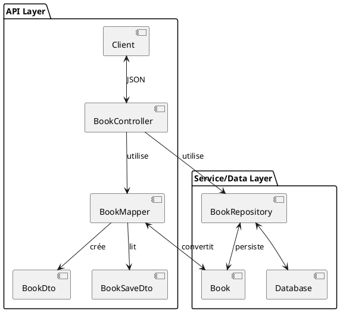

# Chapitre 3 : Gestion des Données d'Entrée - L'Essentiel

Nous avons une API fonctionnelle, capable de réaliser des opérations CRUD. C'est formidable ! Mais en y regardant de
plus près, nous avons un petit souci architectural. Nos endpoints "parlent" directement avec nos entités JPA. C'est un
peu comme si un acteur venait sur scène directement depuis sa loge, sans costume ni maquillage. Le public verrait tout,
y compris les détails des coulisses qu'il n'est pas censé voir. Il est temps d'habiller nos données pour la scène !

### Objectifs Pédagogiques

À la fin de cette partie, vous serez capable de :

- Comprendre les risques liés à l'exposition directe des entités JPA.
- Définir le rôle et l'intérêt d'un DTO (Data Transfer Object).
- Créer des DTOs distincts pour les données en entrée (création/mise à jour) et en sortie (lecture).
- Mettre en place une couche de "mapping" pour convertir les entités en DTOs, et vice-versa.
- Refactoriser un contrôleur pour utiliser les DTOs, créant ainsi un contrat d'API clair et stable.

### Introduction : Le Costume de Scène de Vos Données

Imaginez notre entité JPA `Book` comme un acteur. Elle possède une vie interne riche et complexe : des relations avec
d'autres entités (`Author`), des annotations techniques pour la base de données (`@Id`, `@Entity`), etc. C'est sa "
vraie" nature, en coulisses.

Maintenant, imaginez le client de notre API (une application mobile, un site web) comme le public. Le public n'a pas
besoin de connaître tous les détails internes de l'acteur. Il a juste besoin de voir le personnage, avec son costume et
son dialogue. Ce costume, c'est le **DTO (Data Transfer Object)**.

Le DTO est une représentation sur mesure de nos données, conçue spécifiquement pour la communication. Il agit comme un
contrat, une façade qui protège notre logique interne tout en présentant au client exactement ce dont il a besoin, ni
plus, ni moins.

### Le Problème : Exposer les Entités JPA

Exposer directement nos entités `@Entity` dans notre API est une pratique courante pour les projets simples, mais elle
présente plusieurs inconvénients majeurs à mesure que l'application grandit :

1. **Risques de Sécurité :** On peut exposer accidentellement des données sensibles (par exemple, un champ
   `internalNotes` sur un livre).
2. **Couplage Fort :** Le contrat de votre API est directement lié à la structure de votre base de données. Si vous
   renommez une colonne en base, vous cassez votre API pour tous vos clients.
3. **Problèmes de Sérialisation :** Comme nous l'avons vu, les relations bidirectionnelles (`Book` -> `Author` ->
   `Book`...) peuvent provoquer des boucles infinies lors de la conversion en JSON.
4. **Manque de Flexibilité :** Vous êtes obligé d'envoyer toute l'entité, même si le client n'a besoin que de deux
   champs. Pour la création, le client pourrait envoyer des champs qu'il n'est pas censé modifier, comme l'ID.

### La Solution : Les Data Transfer Objects (DTO)

Un DTO est une simple classe Java (un POJO) dont le seul but est de transporter des données entre les couches de
l'application.

<procedure title="Création de nos DTOs pour le Livre">

Nous allons créer deux types de DTOs pour nos livres :

- `BookDto` : Pour représenter un livre en sortie (ce que le client reçoit).
- `BookSaveDto` : Pour représenter les données d'un livre en entrée (ce que le client envoie pour créer ou modifier).

1. Créez un nouveau package `fr.formation.spring.bibliotech.api.dto`.
2. Créez-y les classes suivantes :

<tabs>
<tab title="BookDto.java (Sortie)">
```java
// package fr.formation.spring.bibliotech.api.dto;

import lombok.Data;
import java.time.LocalDate;
import java.util.Set;

// DTO pour la représentation d'un livre en sortie.
@Data
public class BookDto {
private Long id;
private String title;
private String isbn;
private LocalDate publicationDate;
// On peut aussi utiliser un DTO pour l'auteur ici !
// Pour l'instant, gardons le nom.
private Set<String> authorNames;
}

```
</tab>
<tab title="BookSaveDto.java (Entrée)">
```java
// package fr.formation.spring.bibliotech.api.dto;

import lombok.Data;
import java.time.LocalDate;
import java.util.Set;

// DTO pour les données de création/mise à jour d'un livre.
@Data
public class BookSaveDto {
    private String title;
    private String isbn;
    private LocalDate publicationDate;
    // Pour créer un livre, le client nous donne les IDs des auteurs.
    private Set<Long> authorIds; 
}
```

</tab>
</tabs>

<note title="Pourquoi deux DTOs ?">
<p>
Remarquez la différence :
</p>
<ul>
<li><b>BookDto</b> contient un <code>id</code> (généré par le serveur) et des <code>authorNames</code> pour une lecture facile.</li>
<li><b>BookSaveDto</b> n'a pas d'<code>id</code> (le client ne doit pas le spécifier) et demande des <code>authorIds</code>, car c'est plus simple pour le client de fournir les IDs des auteurs existants que leurs noms complets.</li>
</ul>
Cette séparation nous donne une flexibilité et une sécurité maximales.
</note>

</procedure>

### Le "Mapper" : Le Traducteur

Maintenant que nous avons nos DTOs, il nous faut un moyen de "traduire" une `Book` (entité) en `BookDto` (DTO de
sortie), et un `BookSaveDto` (DTO d'entrée) en `Book` (entité). C'est le rôle du mapper.

Pour commencer, nous allons créer un mapper manuellement. C'est une classe de service simple.

<procedure title="Création du BookMapper">
1.  Créez un nouveau package `fr.formation.spring.bibliotech.api.mapper`.
2.  Créez-y la classe `BookMapper.java`.

```java
// package fr.formation.spring.bibliotech.api.mapper;

import fr.formation.spring.bibliotech.api.dto.BookDto;
import fr.formation.spring.bibliotech.api.dto.BookSaveDto;
import fr.formation.spring.bibliotech.dal.entities.Author;
import fr.formation.spring.bibliotech.dal.entities.Book;
import fr.formation.spring.bibliotech.dal.repositories.AuthorRepository;
import org.springframework.stereotype.Component;

import java.util.stream.Collectors;

@Component // Pour que Spring puisse l'injecter dans notre contrôleur
public class BookMapper {

    private final AuthorRepository authorRepository;

    public BookMapper(AuthorRepository authorRepository) {
        this.authorRepository = authorRepository;
    }

    // Convertit une Entité Book en DTO de sortie BookDto
    public BookDto toDto(Book entity) {
        if (entity == null) {
            return null;
        }
        BookDto dto = new BookDto();
        dto.setId(entity.getId());
        dto.setTitle(entity.getTitle());
        dto.setIsbn(entity.getIsbn());
        dto.setPublicationDate(entity.getPublicationDate());

        // Pour les auteurs, on extrait juste leur nom complet.
        if (entity.getAuthors() != null) {
            dto.setAuthorNames(entity.getAuthors().stream()
                    .map(author -> author.getFirstName() + " " + author.getLastName())
                    .collect(Collectors.toSet()));
        }
        return dto;
    }

    // Convertit un DTO d'entrée BookSaveDto en Entité Book
    public Book toEntity(BookSaveDto dto) {
        if (dto == null) {
            return null;
        }
        Book entity = new Book();
        entity.setTitle(dto.getTitle());
        entity.setIsbn(dto.getIsbn());
        entity.setPublicationDate(dto.getPublicationDate());

        // Pour les IDs des auteurs, on va chercher les entités
        // correspondantes dans la base.
        if (dto.getAuthorIds() != null) {
            entity.setAuthors(dto.getAuthorIds().stream()
                    .map(authorRepository::findById)
                    .filter(java.util.Optional::isPresent)
                    .map(java.util.Optional::get)
                    .collect(Collectors.toSet()));
        }
        return entity;
    }
}
```

</procedure>

### Refactorisation du Contrôleur

Armés de nos DTOs et de notre mapper, nous pouvons enfin nettoyer notre `BookController`.

<procedure title="Mise à jour du BookController">

```java
// package fr.formation.spring.bibliotech.api;
// ... imports

import fr.formation.spring.bibliotech.api.dto.BookDto;
import fr.formation.spring.bibliotech.api.dto.BookSaveDto;
import fr.formation.spring.bibliotech.api.mapper.BookMapper;

import java.util.List;
import java.util.stream.Collectors;


@RestController
@RequestMapping("/api/books")
public class BookController {

    private final BookRepository bookRepository;
    private final BookMapper bookMapper; // On injecte notre mapper

    public BookController(BookRepository bookRepository, BookMapper bookMapper) {
        this.bookRepository = bookRepository;
        this.bookMapper = bookMapper;
    }

    // L'endpoint GET retourne maintenant une liste de BookDto
    @GetMapping
    public List<BookDto> getAllBooks() {
        return this.bookRepository.findAll().stream()
                .map(this.bookMapper::toDto) // On mappe chaque livre
                .collect(Collectors.toList());
    }

    // La création prend maintenant un BookSaveDto en entrée
    @PostMapping
    public ResponseEntity<BookDto> createBook(@RequestBody BookSaveDto bookToCreate) {
        // On convertit le DTO d'entrée en entité
        Book newBook = this.bookMapper.toEntity(bookToCreate);
        Book savedBook = this.bookRepository.save(newBook);

        URI location = ServletUriComponentsBuilder
                .fromCurrentRequest().path("/{id}")
                .buildAndExpand(savedBook.getId()).toUri();

        // On retourne le DTO de sortie
        return ResponseEntity.created(location).body(this.bookMapper.toDto(savedBook));
    }

    // ... les autres méthodes (GET by ID, PUT, DELETE) 
    // devraient être mises à jour de la même manière.
}
```

</procedure>



### Exercice 4 : Appliquer le Pattern DTO aux Auteurs

Votre mission : refactoriser la gestion des auteurs pour utiliser des DTOs.

**Énoncé :**

1. Créez les DTOs `AuthorDto` (pour la sortie, avec `id`, `firstName`, `lastName`) et `AuthorSaveDto` (pour l'entrée,
   avec `firstName` et `lastName`) dans le package `api.dto`.
2. Créez un `AuthorMapper` manuel dans le package `api.mapper` pour gérer la conversion entre `Author` et ses DTOs.
3. Refactorisez entièrement le `AuthorController` pour :
    - Retourner des `List<AuthorDto>` ou `ResponseEntity<AuthorDto>`.
    - Accepter un `AuthorSaveDto` pour la création (`POST`) et la mise à jour (`PUT`).
4. Testez vos endpoints `GET /api/authors` et `POST /api/authors` pour vérifier que le nouveau contrat d'API fonctionne.

### Correction exercice 4 {collapsible="true"}

**1. Les DTOs pour `Author`**

`AuthorDto.java`

```java
// package fr.formation.spring.bibliotech.api.dto;

import lombok.Data;

@Data
public class AuthorDto {
    private Long id;
    private String firstName;
    private String lastName;
}
```

`AuthorSaveDto.java`

```java
// package fr.formation.spring.bibliotech.api.dto;

import lombok.Data;

@Data
public class AuthorSaveDto {
    private String firstName;
    private String lastName;
}
```

**2. Le Mapper `AuthorMapper.java`**

```java
// package fr.formation.spring.bibliotech.api.mapper;

import fr.formation.spring.bibliotech.api.dto.AuthorDto;
import fr.formation.spring.bibliotech.api.dto.AuthorSaveDto;
import fr.formation.spring.bibliotech.dal.entities.Author;
import org.springframework.stereotype.Component;

@Component
public class AuthorMapper {

    public AuthorDto toDto(Author entity) {
        if (entity == null) return null;
        AuthorDto dto = new AuthorDto();
        dto.setId(entity.getId());
        dto.setFirstName(entity.getFirstName());
        dto.setLastName(entity.getLastName());
        return dto;
    }

    public Author toEntity(AuthorSaveDto dto) {
        if (dto == null) return null;
        Author entity = new Author();
        entity.setFirstName(dto.getFirstName());
        entity.setLastName(dto.getLastName());
        return entity;
    }

    // Méthode pour la mise à jour, qui modifie une entité existante
    public void updateEntity(AuthorSaveDto dto, Author entity) {
        if (dto == null || entity == null) return;
        entity.setFirstName(dto.getFirstName());
        entity.setLastName(dto.getLastName());
    }
}
```

**3. Le `AuthorController` refactorisé**

```java
// package fr.formation.spring.bibliotech.api;

import fr.formation.spring.bibliotech.api.dto.AuthorDto;
import fr.formation.spring.bibliotech.api.dto.AuthorSaveDto;
import fr.formation.spring.bibliotech.api.mapper.AuthorMapper;
import fr.formation.spring.bibliotech.dal.entities.Author;
import fr.formation.spring.bibliotech.dal.repositories.AuthorRepository;
import org.springframework.http.ResponseEntity;
import org.springframework.web.bind.annotation.*;
import org.springframework.web.servlet.support.ServletUriComponentsBuilder;

import java.net.URI;
import java.util.List;
import java.util.stream.Collectors;

@RestController
@RequestMapping("/api/authors")
public class AuthorController {

    private final AuthorRepository authorRepository;
    private final AuthorMapper authorMapper;

    public AuthorController(AuthorRepository authorRepository, AuthorMapper authorMapper) {
        this.authorRepository = authorRepository;
        this.authorMapper = authorMapper;
    }

    @GetMapping
    public List<AuthorDto> getAllAuthors() {
        return this.authorRepository.findAll().stream()
                .map(this.authorMapper::toDto)
                .collect(Collectors.toList());
    }

    @GetMapping("/{id}")
    public ResponseEntity<AuthorDto> getAuthorById(@PathVariable Long id) {
        return this.authorRepository.findById(id)
                .map(this.authorMapper::toDto)
                .map(ResponseEntity::ok)
                .orElse(ResponseEntity.notFound().build());
    }

    @PostMapping
    public ResponseEntity<AuthorDto> createAuthor(@RequestBody AuthorSaveDto authorDto) {
        Author author = this.authorMapper.toEntity(authorDto);
        Author savedAuthor = this.authorRepository.save(author);
        URI location = ServletUriComponentsBuilder
                .fromCurrentRequest().path("/{id}")
                .buildAndExpand(savedAuthor.getId()).toUri();
        return ResponseEntity.created(location).body(this.authorMapper.toDto(savedAuthor));
    }

    @PutMapping("/{id}")
    public ResponseEntity<AuthorDto> updateAuthor(@PathVariable Long id,
                                                  @RequestBody AuthorSaveDto authorDto) {
        return this.authorRepository.findById(id)
                .map(author -> {
                    this.authorMapper.updateEntity(authorDto, author);
                    Author updatedAuthor = this.authorRepository.save(author);
                    return ResponseEntity.ok(this.authorMapper.toDto(updatedAuthor));
                })
                .orElse(ResponseEntity.notFound().build());
    }

    @DeleteMapping("/{id}")
    public ResponseEntity<Void> deleteAuthor(@PathVariable Long id) {
        if (authorRepository.existsById(id)) {
            authorRepository.deleteById(id);
            return ResponseEntity.noContent().build();
        }
        return ResponseEntity.notFound().build();
    }
}
```

### Auto-évaluation

1. **(QCM)** Quel est le principal avantage de l'utilisation des DTOs dans une API REST ?
   a) Améliorer les performances de la base de données.
   b) Rendre le code du contrôleur plus court.
   c) Découpler le contrat d'API de la structure de la base de données.
   d) Simplifier les requêtes SQL.

2. **_ (Question ouverte)_** Pourquoi est-il judicieux d'avoir un DTO différent pour la création (`POST`) et la
   lecture (`GET`) d'une même ressource ?

3. **(QCM)** Dans quel composant a lieu la conversion entre une entité et un DTO ?
   a) Le Contrôleur
   b) Le Repository
   c) Le Mapper
   d) L'Entité elle-même

4. **_ (Question ouverte)_** Citez deux problèmes que l'utilisation des DTOs permet de résoudre par rapport à l'
   exposition directe des entités JPA.

5. **_ (Question ouverte)_** Dans notre `BookMapper`, la méthode `toEntity` prend un `BookSaveDto` et a besoin du
   `AuthorRepository`. Expliquez pourquoi ce repository est nécessaire.

### Conclusion

Félicitations ! Vous venez de faire passer votre API à un niveau supérieur de professionnalisme. En introduisant la
couche DTO, vous avez créé un "contrat" clair et robuste avec les clients de votre API. Votre application est maintenant
plus sûre, plus flexible et plus facile à maintenir. Le découplage entre l'API et la base de données est une des pierres
angulaires d'une architecture logicielle saine.

Cependant, notre travail n'est pas terminé. Pour l'instant, nous faisons aveuglément confiance aux données envoyées par
le client. Que se passe-t-il si un client essaie de créer un livre sans titre ? Ou avec un ISBN invalide ? Dans la
partie suivante, nous allons apprendre à valider les données entrantes pour garantir l'intégrité de notre système. Nous
verrons également comment automatiser la fastidieuse tâche de mapping.