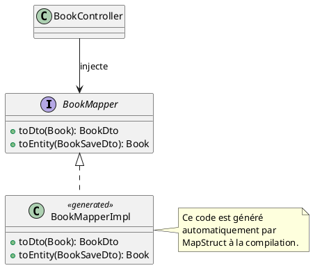

# Chapitre 3 : Validation et Mapping Automatisé - Pour aller plus loin

Nous avons mis en place une façade élégante pour notre API avec les DTOs. Mais que se passe-t-il si un client malicieux
ou une application buguée nous envoie des données incomplètes ? Un livre sans titre, un auteur avec un nom vide... Notre
application doit être assez robuste pour refuser poliment ces "costumes" mal taillés. De plus, écrire les traducteurs (
mappers) à la main est répétitif et source d'erreurs. Il est temps d'automatiser tout ça !

### Objectifs Pédagogiques

À la fin de cette partie, vous serez capable de :

- Mettre en œuvre la validation des données d'entrée (DTOs) à l'aide de Jakarta Bean Validation.
- Utiliser les annotations de validation standards comme `@NotBlank`, `@Size`, `@NotNull`.
- Déclencher la validation dans vos contrôleurs avec l'annotation `@Valid`.
- Comprendre le concept de mapping automatisé et ses avantages.
- Intégrer et configurer la bibliothèque MapStruct pour générer les mappers automatiquement.
- Transformer un mapper manuel en une interface MapStruct, y compris pour des cas de mapping complexes.

### Introduction : Le Contrôle Qualité de l'API

Imaginez que notre API est une usine d'assemblage de haute précision. Les DTOs d'entrée (`BookSaveDto`) sont les pièces
détachées qui arrivent sur le tapis roulant. Avant de les utiliser pour assembler nos produits finis (nos entités
`Book`), nous avons besoin d'un **contrôle qualité**. Ce contrôle doit vérifier que chaque pièce respecte les
spécifications : le titre n'est pas vide, l'ISBN a le bon format, etc. C'est le rôle de la **validation**.

Ensuite, l'assemblage lui-même. Le faire à la main est lent et on risque d'oublier une vis. Ne serait-il pas mieux
d'avoir un robot ultra-précis qui fait le travail à notre place, sans jamais se tromper ? C'est le rôle du **mapping
automatisé**. Mettons en place notre chaîne de production moderne !

### 1. Validation des Données d'Entrée

Spring Boot s'intègre parfaitement avec la spécification **Jakarta Bean Validation**. La dépendance
`spring-boot-starter-validation` (que nous avons déjà dans notre `pom.xml`) nous donne accès à un ensemble d'annotations
pour définir des règles de validation directement sur les champs de nos DTOs.

<procedure title="Ajout de la validation au DTO BookSaveDto">

Modifions notre DTO `BookSaveDto` pour y ajouter des contraintes.

```java
// package fr.formation.spring.bibliotech.api.dto;

import jakarta.validation.constraints.NotBlank;
import jakarta.validation.constraints.NotEmpty;
import jakarta.validation.constraints.NotNull;
import jakarta.validation.constraints.Size;
import lombok.Data;

import java.time.LocalDate;
import java.util.Set;

@Data
public class BookSaveDto {

    // Le titre ne doit pas être nul et ne doit pas être une chaîne vide.
    // Il doit contenir entre 3 et 150 caractères.
    @NotBlank(message = "Le titre ne peut pas être vide.")
    @Size(min = 3, max = 150, message = "Le titre doit faire entre 3 et 150 caractères.")
    private String title;

    @NotBlank(message = "L'ISBN ne peut pas être vide.")
    private String isbn;

    // La date de publication ne doit pas être nulle.
    @NotNull(message = "La date de publication est requise.")
    private LocalDate publicationDate;

    // La liste des IDs d'auteurs ne doit pas être vide.
    @NotEmpty(message = "Un livre doit avoir au moins un auteur.")
    private Set<Long> authorIds;
}
```

<note title="NotBlank vs NotNull vs NotEmpty">

<ul>
    <li><code>@NotNull</code>: L'objet ne peut pas être nul.</li>
    <li><code>@NotEmpty</code>: Pour les collections, chaînes, etc. Ne peut être nul et ne peut pas être vide (<code>size() > 0</code>).</li>
    <li><code>@NotBlank</code>: Spécifique aux chaînes de caractères. Ne peut être nul et doit contenir au moins un caractère non blanc.</li>
</ul>

</note>

</procedure>

Maintenant que les règles sont définies, il faut dire à Spring de les vérifier. Cela se fait dans le contrôleur avec
l'annotation `@Valid`.

<procedure title="Activation de la validation dans le BookController">

```java
// Dans BookController.java

import jakarta.validation.Valid;

// ...

@PostMapping
public ResponseEntity<BookDto> createBook(
        @Valid @RequestBody BookSaveDto bookToCreate) {
    // L'annotation @Valid demande à Spring de valider l'objet
    // bookToCreate après l'avoir désérialisé du JSON.

    // ... (le reste du code ne change pas)
    Book newBook = this.bookMapper.toEntity(bookToCreate);
    // ...
}
```

</procedure>

Que se passe-t-il maintenant si un client envoie un JSON invalide ?

```http
### Tentative de création d'un livre invalide
POST http://localhost:8080/api/books
Content-Type: application/json

{
  "title": "",
  "isbn": "12345",
  "publicationDate": "2023-01-01"
}
```

Spring Boot va intercepter la requête. La validation va échouer (le titre est vide, `authorIds` est manquant). Spring va
alors automatiquement lever une `MethodArgumentNotValidException` et retourner une réponse **`400 Bad Request`** avec un
corps JSON détaillant les erreurs. C'est exactement ce que nous voulons ! Dans le prochain chapitre, nous apprendrons à
personnaliser ce message d'erreur.

### 2. Mapping Automatisé avec MapStruct

Écrire les mappers à la main, c'est bien pour apprendre, mais en production, c'est une source de bugs et de code
répétitif. MapStruct est un processeur d'annotations qui **génère le code du mapper pour nous à la compilation**.

**Avantages :**

- **Performance :** Il génère du code Java pur, sans utiliser la réflexion. C'est aussi rapide que du code écrit à la
  main.
- **Sécurité de typage :** Les erreurs de mapping sont détectées à la compilation, pas à l'exécution.
- **Moins de code :** On écrit une interface, MapStruct écrit l'implémentation.

<procedure title="Configuration de MapStruct dans le pom.xml">
Pour que MapStruct fonctionne, nous devons ajouter sa dépendance et configurer le plugin du compilateur Maven.

```xml
<!-- Dans la section <properties> de votre pom.xml -->
<org.mapstruct.version>1.5.5.Final</org.mapstruct.version>

        <!-- Dans la section <dependencies> -->
<dependency>
<groupId>org.mapstruct</groupId>
<artifactId>mapstruct</artifactId>
<version>${org.mapstruct.version}</version>
</dependency>

        <!-- Dans la section <build><plugins> -->
<plugin>
<groupId>org.apache.maven.plugins</groupId>
<artifactId>maven-compiler-plugin</artifactId>
<version>3.8.1</version>
<configuration>
    <source>17</source>
    <target>17</target>
    <annotationProcessorPaths>
        <!-- Important : le processeur d'annotations MapStruct -->
        <path>
            <groupId>org.mapstruct</groupId>
            <artifactId>mapstruct-processor</artifactId>
            <version>${org.mapstruct.version}</version>
        </path>
        <!-- Ne pas oublier Lombok ! -->
        <path>
            <groupId>org.projectlombok</groupId>
            <artifactId>lombok</artifactId>
            <version>${lombok.version}</version>
        </path>
        <path>
            <groupId>org.projectlombok</groupId>
            <artifactId>lombok-mapstruct-binding</artifactId>
            <version>0.2.0</version>
        </path>
    </annotationProcessorPaths>
</configuration>
</plugin>
```

</procedure>

Maintenant, transformons notre `BookMapper` manuel en interface MapStruct.

<procedure title="Création de l'interface BookMapper avec MapStruct">
Supprimez le contenu de votre classe `BookMapper.java` et remplacez-le par cette interface :

```java
// package fr.formation.spring.bibliotech.api.mapper;

import fr.formation.spring.bibliotech.api.dto.BookDto;
import fr.formation.spring.bibliotech.api.dto.BookSaveDto;
import fr.formation.spring.bibliotech.dal.entities.Author;
import fr.formation.spring.bibliotech.dal.entities.Book;
import fr.formation.spring.bibliotech.dal.repositories.AuthorRepository;
import org.mapstruct.Mapper;
import org.mapstruct.Mapping;
import org.mapstruct.Named;

import java.util.Set;
import java.util.stream.Collectors;

// componentModel="spring" génère un @Component sur l'implémentation,
// la rendant injectable.
// uses = {AuthorRepository.class} permet à MapStruct d'injecter et
// d'utiliser ce repository.
@Mapper(componentModel = "spring", uses = {AuthorRepository.class})
public interface BookMapper {

    // MapStruct gère automatiquement les champs avec le même nom.
    // Pour "authorNames", le mapping est complexe, on le spécifie.
    @Mapping(target = "authorNames", source = "authors", qualifiedByName = "authorsToNames")
    BookDto toDto(Book entity);

    // Pour le DTO -> Entité, on doit gérer la conversion des IDs en entités.
    @Mapping(target = "authors", source = "authorIds")
    Book toEntity(BookSaveDto dto);

    // Cette méthode nommée "authorsToNames" sera utilisée par MapStruct 
    // pour le mapping personnalisé.
    @Named("authorsToNames")
    default Set<String> authorsToNames(Set<Author> authors) {
        if (authors == null) {
            return null;
        }
        return authors.stream()
                .map(author -> author.getFirstName() + " " + author.getLastName())
                .collect(Collectors.toSet());
    }
}
```

</procedure>

Après avoir recompilé votre projet (ex: `mvn clean install`), MapStruct va générer une classe `BookMapperImpl.java` dans
`target/generated-sources`. Votre `BookController` peut continuer à l'utiliser sans aucun changement, car il dépend de
l'interface `BookMapper`, pas de son implémentation.



### Exercice 5 : Validation et Mapping pour les Auteurs

Mettez en pratique ces deux concepts sur les auteurs.

**Énoncé :**

1. Dans `AuthorSaveDto`, ajoutez des annotations de validation pour que `firstName` et `lastName` ne soient pas blancs (
   `@NotBlank`).
2. Dans `AuthorController`, activez la validation pour les méthodes de création (`POST`) et de mise à jour (`PUT`) en
   utilisant `@Valid`.
3. Transformez votre `AuthorMapper` manuel en une interface gérée par MapStruct. Comme les noms de champs correspondent
   parfaitement, cela devrait être très simple.
4. Assurez-vous que votre `AuthorController` utilise bien la nouvelle interface du mapper (il ne devrait y avoir aucun
   changement à faire dans le contrôleur si l'injection se faisait déjà par l'interface).
5. Testez en essayant de créer un auteur avec un prénom vide. Vous devriez obtenir une erreur `400 Bad Request`.

### Correction exercice 5 {collapsible="true"}

**1. `AuthorSaveDto` avec validation**

```java
// package fr.formation.spring.bibliotech.api.dto;

import jakarta.validation.constraints.NotBlank;
import lombok.Data;

@Data
public class AuthorSaveDto {
    @NotBlank(message = "Le prénom ne peut pas être vide.")
    private String firstName;

    @NotBlank(message = "Le nom ne peut pas être vide.")
    private String lastName;
}
```

**2. `AuthorController` avec `@Valid`**

```java
// Dans AuthorController.java

import jakarta.validation.Valid;

//...

@PostMapping
public ResponseEntity<AuthorDto> createAuthor(
        @Valid @RequestBody AuthorSaveDto authorDto) {
    //...
}

        @PutMapping("/{id}")
        public ResponseEntity<AuthorDto> updateAuthor(@PathVariable Long id,
                                                      @Valid @RequestBody AuthorSaveDto authorDto) {
            //...
        }
```

**3. Interface `AuthorMapper` avec MapStruct**

```java
// package fr.formation.spring.bibliotech.api.mapper;

import fr.formation.spring.bibliotech.api.dto.AuthorDto;
import fr.formation.spring.bibliotech.api.dto.AuthorSaveDto;
import fr.formation.spring.bibliotech.dal.entities.Author;
import org.mapstruct.Mapper;
import org.mapstruct.MappingTarget;

@Mapper(componentModel = "spring")
public interface AuthorMapper {

    AuthorDto toDto(Author entity);

    Author toEntity(AuthorSaveDto dto);

    // MapStruct sait générer une méthode de mise à jour.
    // @MappingTarget indique que c'est l'objet à mettre à jour.
    void updateEntity(AuthorSaveDto dto, @MappingTarget Author entity);
}
```

**4. Test de la validation**
Créez une requête HTTP pour tester.

```http
### Tentative de création d'un auteur invalide
POST http://localhost:8080/api/authors
Content-Type: application/json

{
  "firstName": "",
  "lastName": "Wells"
}
```

Vous devriez recevoir une réponse `400 Bad Request` avec un corps similaire à celui-ci, généré par Spring Boot :

```json
{
  "type": "about:blank",
  "title": "Bad Request",
  "status": 400,
  "detail": "Invalid request content.",
  "instance": "/api/authors",
  "errors": {
    "firstName": "Le prénom ne peut pas être vide."
  }
}
```

### Auto-évaluation

1. **(QCM)** Quelle annotation faut-il ajouter dans une méthode de contrôleur pour déclencher la validation d'un objet
   du corps de la requête ?
   a) `@Validate`
   b) `@Check`
   c) `@Valid`
   d) `@Constraint`

2. **_ (Question ouverte)_** Pourquoi MapStruct est-il généralement plus performant que d'autres bibliothèques de
   mapping comme ModelMapper ?

3. **(QCM)** Où placez-vous les annotations de validation comme `@NotBlank` ou `@Size` ?
   a) Sur les entités JPA.
   b) Sur les DTOs d'entrée.
   c) Dans les méthodes du contrôleur.
   d) Sur les interfaces de Repository.

4. **_ (Question ouverte)_** Que fait l'attribut `componentModel = "spring"` dans l'annotation `@Mapper` de MapStruct ?

5. **_ (Question ouverte)_** Si vous essayez de créer un livre avec un `title` qui ne respecte pas la contrainte
   `@Size(min=3)`, quel code de statut HTTP votre API devrait-elle retourner par défaut ?

### Conclusion

Vous avez ajouté deux cordes essentielles à votre arc de développeur d'API. Vous savez maintenant comment **protéger
votre application** contre les données invalides grâce à la validation, garantissant ainsi l'intégrité de votre système.
De plus, en adoptant MapStruct, vous avez appris à **automatiser une tâche répétitive**, ce qui rend votre code plus
propre, plus sûr et vous permet de vous concentrer sur la logique métier, qui est la vraie valeur ajoutée de votre
travail.

Cependant, la réponse d'erreur par défaut de Spring, bien qu'informative pour un développeur, n'est pas toujours idéale
pour les consommateurs de l'API. Comment la personnaliser ? Comment gérer d'autres types d'erreurs, comme un ISBN qui
existerait déjà ? C'est précisément ce que nous aborderons dans le prochain chapitre, dédié à la **gestion centralisée
et élégante des erreurs**.