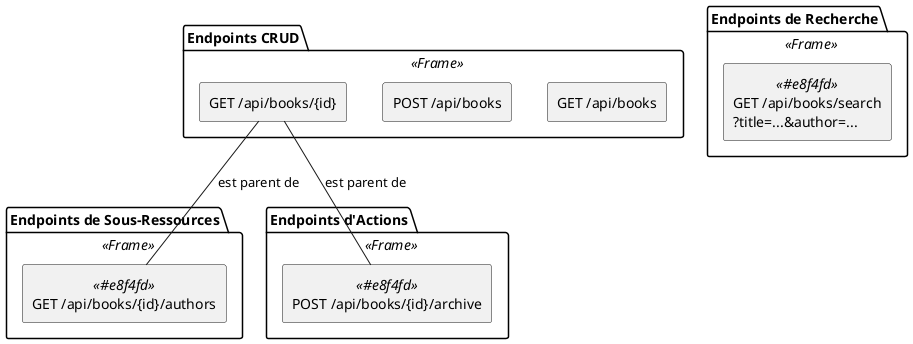

# Chapitre 5 : Patterns REST Avancés - L'Essentiel

Le modèle CRUD (Créer, Lire, Mettre à Jour, Supprimer) est le pain quotidien du développeur d'API REST. Il couvre 80%
des besoins. Mais que faire pour les 20% restants ? Comment gérer une recherche complexe avec de multiples filtres ?
Comment modéliser une action qui n'est ni une création, ni une mise à jour, comme "publier un livre" ou "inscrire un
lecteur à une bibliothèque" ? C'est là que les patterns REST avancés entrent en scène.

### Objectifs Pédagogiques

À la fin de cette partie, vous serez capable de :

- Implémenter une fonctionnalité de recherche multicritères de manière propre et évolutive.
- Utiliser les spécifications Spring Data JPA pour construire des requêtes dynamiques.
- Comprendre et utiliser les sous-ressources pour modéliser des relations hiérarchiques.
- Modéliser des actions (verbes métier) qui ne correspondent pas au modèle CRUD standard.

### Introduction : Au-delà du CRUD

Notre API "BiblioTech" est déjà très capable, mais ses fonctionnalités restent basiques. Un utilisateur de bibliothèque
ne veut pas seulement "lister tous les livres". Il veut "trouver tous les livres de J.K. Rowling publiés après 1995"
ou "voir tous les livres disponibles dans la Bibliothèque Nationale de France". Un bibliothécaire ne veut pas
seulement "mettre à jour un livre", il veut effectuer l'action de "prêter un livre".

Tenter de faire rentrer ces actions dans le moule strict du CRUD serait maladroit. Nous allons donc apprendre de
nouvelles techniques pour concevoir des endpoints plus expressifs et plus puissants, tout en respectant l'esprit de
REST.

### 1. Recherche et Filtrage Avancés

Le besoin le plus courant est la recherche. Une approche naïve consisterait à ajouter une multitude de `@RequestParam` à
notre méthode `getAllBooks`, mais cela devient vite ingérable.

```java
// L'approche à éviter !
@GetMapping
public List<BookDto> searchBooks(
        @RequestParam(required = false) String title,
        @RequestParam(required = false) String authorLastName,
        @RequestParam(required = false) LocalDate publishedAfter
        // ... et 10 autres paramètres ?
) { /* ... */ }
```

Une meilleure approche consiste à utiliser les **Spécifications Spring Data JPA**. Une spécification est un objet qui
décrit un critère de recherche. On peut les combiner pour construire dynamiquement une requête complexe.

<procedure title="Création d'un service de recherche avec Spécifications">
1.  **Créez une classe `BookSpecification`** qui contiendra des méthodes statiques pour générer nos critères.

```java
// package fr.formation.spring.bibliotech.dal.spec;

import fr.formation.spring.bibliotech.dal.entities.Book;
import org.springframework.data.jpa.domain.Specification;

import java.time.LocalDate;

public class BookSpecification {

    // Spécification pour filtrer par titre (recherche partielle)
    public static Specification<Book> hasTitle(String title) {
        return (root, query, criteriaBuilder) ->
                criteriaBuilder.like(root.get("title"), "%" + title + "%");
    }

    // Spécification pour filtrer par date de publication (après une date)
    public static Specification<Book> publishedAfter(LocalDate date) {
        return (root, query, criteriaBuilder) ->
                criteriaBuilder.greaterThanOrEqualTo(root.get("publicationDate"), date);
    }

    // Spécification pour filtrer par nom de l'auteur
    public static Specification<Book> hasAuthorLastName(String lastName) {
        return (root, query, criteriaBuilder) ->
                criteriaBuilder.like(root.join("authors").get("lastName"), "%" + lastName + "%");
    }
}
```

2. **Modifiez votre `BookRepository`** pour qu'il hérite de `JpaSpecificationExecutor<Book>`.

```java
// package fr.formation.spring.bibliotech.dal.repositories;

import org.springframework.data.jpa.repository.JpaSpecificationExecutor;
//...

public interface BookRepository extends JpaRepository<Book, Long>, JpaSpecificationExecutor<Book> {
    //...
}
```

Cela lui donne de nouvelles méthodes, notamment `findAll(Specification<T> spec, Pageable pageable)`.

3. **Mettez à jour le contrôleur** pour accepter les paramètres de recherche et construire la spécification.

```java
// Dans BookController.java

import fr.formation.spring.bibliotech.dal.spec.BookSpecification;
import org.springframework.data.jpa.domain.Specification;

//...

@Operation(summary = "Recherche des livres selon plusieurs critères")
@GetMapping("/search") // Un endpoint dédié pour la recherche
public Page<BookDto> searchBooks(
        @RequestParam(required = false) String title,
        @RequestParam(required = false) String authorLastName,
        @RequestParam(required = false) LocalDate publishedAfter,
        Pageable pageable) {

    Specification<Book> spec = Specification.where(null); // Spec de base

    if (title != null && !title.isEmpty()) {
        spec = spec.and(BookSpecification.hasTitle(title));
    }
    if (authorLastName != null && !authorLastName.isEmpty()) {
        spec = spec.and(BookSpecification.hasAuthorLastName(authorLastName));
    }
    if (publishedAfter != null) {
        spec = spec.and(BookSpecification.publishedAfter(publishedAfter));
    }

    return this.bookRepository.findAll(spec, pageable)
            .map(this.bookMapper::toDto);
}
```

Cette approche est propre, modulaire et très facile à étendre avec de nouveaux critères.
</procedure>

### 2. Les Sous-Ressources

Parfois, des ressources sont naturellement imbriquées. Par exemple, les auteurs d'un livre spécifique. Plutôt que de
créer un endpoint de recherche complexe, on peut modéliser cela comme une sous-ressource.

**URI d'une sous-ressource :** `/api/books/{bookId}/authors`

Cela se traduit par "donne-moi les auteurs *du livre avec l'ID {bookId}*". C'est très expressif.

<procedure title="Créer un endpoint pour une sous-ressource">
On peut ajouter cette méthode directement dans `BookController` ou créer un contrôleur dédié. Pour un cas simple, l'ajouter au contrôleur parent est acceptable.

```java
// Dans BookController.java

import fr.formation.spring.bibliotech.api.dto.AuthorDto;
import fr.formation.spring.bibliotech.api.mapper.AuthorMapper;

// ...
public class BookController {
    // ...
    private final AuthorMapper authorMapper;

    // N'oubliez pas d'injecter AuthorMapper dans le constructeur !
    public BookController(...,AuthorMapper authorMapper) {
        // ...
        this.authorMapper = authorMapper;
    }

    @Operation(summary = "Récupère les auteurs d'un livre spécifique")
    @GetMapping("/{bookId}/authors")
    public ResponseEntity<Set<AuthorDto>> getAuthorsOfBook(@PathVariable Long bookId) {
        Book book = bookRepository.findById(bookId)
                .orElseThrow(() -> new ResourceNotFoundException("Book", bookId));

        Set<AuthorDto> authors = book.getAuthors().stream()
                .map(this.authorMapper::toDto)
                .collect(Collectors.toSet());

        return ResponseEntity.ok(authors);
    }
}
```

</procedure>
`GET /api/books/1/authors` retournera maintenant la liste des auteurs du livre avec l'ID 1.

### 3. Modéliser des Actions

Que faire si l'on veut modéliser une action qui ne rentre pas dans le CRUD, comme "archiver un livre" ? L'archiver ne le
supprime pas (`DELETE`), et ce n'est pas une simple mise à jour de champ (`PUT`).

La convention REST suggère de traiter ces actions comme des sous-ressources de la ressource principale. On utilise le
verbe `POST` (ou `PUT`) sur une URI qui décrit l'action.

**Exemple d'URI d'action :** `POST /api/books/{id}/archive`

<procedure title="Créer un endpoint pour une action">
Ajoutons un champ `boolean archived` à notre entité `Book`.

```java
// Dans l'entité Book.java
private boolean archived = false;
```

Ensuite, créons l'endpoint d'action dans `BookController`.

```java
// Dans BookController.java

@Operation(summary = "Archive un livre, le rendant indisponible.")
@PostMapping("/{id}/archive")
public ResponseEntity<Void> archiveBook(@PathVariable Long id) {
    Book book = bookRepository.findById(id)
            .orElseThrow(() -> new ResourceNotFoundException("Book", id));

    // Ici, on pourrait ajouter une logique métier complexe.
    // Par exemple, vérifier que le livre n'est pas actuellement prêté.
    book.setArchived(true);
    bookRepository.save(book);

    return ResponseEntity.noContent().build();
}

// On pourrait aussi avoir un endpoint pour désarchiver
@DeleteMapping("/{id}/archive")
public ResponseEntity<Void> unarchiveBook(@PathVariable Long id) {
    // ... logique inverse
}
```
</procedure>

Cette approche permet de créer des endpoints très clairs qui représentent des verbes de votre domaine métier, tout en
restant dans le cadre des verbes HTTP standards.



### Exercice 9 : Lister les livres d'un auteur

Mettez en pratique le concept de sous-ressource.

**Énoncé :**

1. Créez un nouvel endpoint dans `AuthorController`.
2. Cet endpoint doit répondre à l'URI `/api/authors/{authorId}/books`.
3. Il doit retourner la liste (`Set<BookDto>`) de tous les livres écrits par l'auteur spécifié.
4. Gérez le cas où l'auteur n'est pas trouvé en retournant une `404 Not Found`.
5. Documentez ce nouvel endpoint avec `@Operation`.

### Correction exercice 9 {collapsible="true"}

**Solution dans `AuthorController.java`**

```java
// package fr.formation.spring.bibliotech.api;

import fr.formation.spring.bibliotech.api.dto.BookDto;
import fr.formation.spring.bibliotech.api.mapper.BookMapper;
//...
import java.util.Set;
import java.util.stream.Collectors;

@Tag(name = "Auteurs", description = "API pour la gestion des auteurs")
@RestController
@RequestMapping("/api/authors")
public class AuthorController {

    private final AuthorRepository authorRepository;
    private final AuthorMapper authorMapper;
    private final BookMapper bookMapper; // Ajout du BookMapper

    // Mise à jour du constructeur pour injecter BookMapper
    public AuthorController(AuthorRepository authorRepository,
                            AuthorMapper authorMapper,
                            BookMapper bookMapper) {
        this.authorRepository = authorRepository;
        this.authorMapper = authorMapper;
        this.bookMapper = bookMapper;
    }

    // ... autres méthodes

    @Operation(summary = "Récupère tous les livres d'un auteur spécifique")
    @GetMapping("/{authorId}/books")
    public ResponseEntity<Set<BookDto>> getBooksByAuthor(
            @PathVariable Long authorId) {
        Author author = authorRepository.findById(authorId)
                .orElseThrow(() -> new ResourceNotFoundException("Author", authorId));

        Set<BookDto> books = author.getBooks().stream()
                .map(this.bookMapper::toDto)
                .collect(Collectors.toSet());

        return ResponseEntity.ok(books);
    }
}
```

**Test :** `GET http://localhost:8080/api/authors/1/books` devrait retourner la liste des livres de J.K. Rowling.

### Auto-évaluation

1. **(QCM)** Quelle est la meilleure approche pour implémenter une recherche multicritères dans Spring Boot ?
   a) Utiliser de nombreux `@RequestParam` dans le contrôleur.
   b) Écrire une requête SQL native complexe avec `@Query`.
   c) Utiliser les Spécifications Spring Data JPA.
   d) Créer un endpoint `POST` pour la recherche.

2. **_ (Question ouverte)_** Donnez un exemple d'URI qui représente une sous-ressource dans notre projet BiblioTech (
   autre que celui de l'exercice).

3. **(QCM)** Pour modéliser une action métier comme "valider une commande", quelle combinaison de verbe HTTP et d'URI
   est la plus conforme aux conventions REST ?
   a) `GET /api/commands/{id}/validate`
   b) `UPDATE /api/commands/{id}`
   c) `POST /api/commands/{id}/validation`
   d) `PUT /api/commands/{id}` avec un corps `{"status": "validated"}`

4. **_ (Question ouverte)_** Quel est l'avantage principal d'utiliser les Spécifications JPA par rapport à la création
   de multiples méthodes de recherche dans le Repository (ex: `findByTitleAndAuthor`, `findByTitleAndPublicationDate`,
   etc.) ?

5. **_ (Question ouverte)_** Dans l'implémentation de la recherche avec Spécifications, à quoi sert
   `Specification.where(null)` ?

### Conclusion

Vous avez exploré les territoires qui se situent au-delà des sentiers battus du CRUD. Vous savez maintenant comment
construire des fonctionnalités de recherche puissantes et évolutives, comment modéliser des relations complexes avec des
sous-ressources et comment donner vie à des actions métier spécifiques. Ces patterns vous donnent la flexibilité
nécessaire pour concevoir des API qui ne sont pas seulement des interfaces de base de données, mais de véritables
représentations de la logique et des processus de votre domaine d'application.

Vous avez maintenant en main tous les outils techniques pour construire des API REST de haute qualité avec Spring Boot.
Les prochaines sections se concentreront sur la consolidation de ces connaissances, en vous donnant des conseils, des
bonnes pratiques et des exemples concrets pour vous aider à appliquer tout ce que vous avez appris.