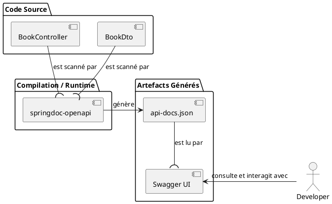

# Chapitre 6 : Documentation des API avec OpenAPI - L'Essentiel

Vous avez bâti une API REST magnifique. Elle est bien structurée, elle gère les erreurs avec élégance, elle est
sécurisée... Mais comment les autres développeurs (ceux qui vont l'utiliser dans une application front-end ou un autre
service) vont-ils savoir comment s'en servir ? Allez-vous leur envoyer un document Word de 20 pages ? Ou pire, leur dire
de "lire le code" ? Certainement pas ! Il nous faut un moyen de générer une documentation vivante, interactive et
toujours à jour.

### Objectifs Pédagogiques

À la fin de cette partie, vous serez capable de :

- Comprendre ce qu'est la spécification OpenAPI (anciennement Swagger).
- Intégrer la bibliothèque `springdoc-openapi` dans un projet Spring Boot.
- Accéder à l'interface utilisateur de Swagger pour explorer et tester votre API.
- Enrichir la documentation générée automatiquement avec des annotations pour la rendre plus descriptive et utile.
- Décrire les modèles de données (DTOs) pour clarifier la signification de chaque champ.

### Introduction : Le Mode d'Emploi de Votre API

Imaginez que vous venez d'acheter un appareil électronique complexe, mais il est livré sans aucun mode d'emploi. Ce
serait une expérience très frustrante. Vous devriez deviner à quoi sert chaque bouton, ce qui est une perte de temps et
source d'erreurs.

Une API sans documentation, c'est la même chose. La spécification **OpenAPI** est une norme industrielle pour décrire
les API REST. Elle permet de définir les endpoints, les paramètres, les corps de requête, les réponses possibles, les
schémas de données, etc., dans un format standardisé (JSON ou YAML).

L'outil **Swagger UI** peut alors lire ce fichier de description et générer une interface web interactive magnifique.
C'est un véritable "mode d'emploi" pour votre API, qui permet non seulement de lire la documentation mais aussi
d'essayer les endpoints directement depuis le navigateur.

### Intégration de `springdoc-openapi`

Heureusement pour nous, intégrer OpenAPI dans un projet Spring Boot est d'une simplicité déconcertante grâce à la
bibliothèque `springdoc-openapi`. Elle va scanner notre code (contrôleurs, DTOs, annotations de validation) et générer
la spécification OpenAPI pour nous, sans effort.

<procedure title="Ajout de la dépendance springdoc-openapi">

Ouvrez votre fichier `pom.xml` et ajoutez la dépendance suivante :

```xml
<!-- Dans la section <dependencies> -->
<dependency>
    <groupId>org.springdoc</groupId>
    <artifactId>springdoc-openapi-starter-webmvc-ui</artifactId>
    <version>2.5.0</version>
</dependency>
```

</procedure>

Et... c'est tout ! Vraiment.

Relancez votre application. Maintenant, ouvrez votre navigateur et accédez à ces deux nouvelles URLs :

1. **L'interface Swagger UI :** `http://localhost:8080/swagger-ui.html`
2. **La spécification OpenAPI brute (JSON) :** `http://localhost:8080/v3/api-docs`

Vous devriez voir une page web listant automatiquement tous vos contrôleurs (`BookController`, `AuthorController`) et
tous leurs endpoints. Vous pouvez déplier chaque endpoint pour voir ses détails et même utiliser le bouton "Try it out"
pour l'exécuter.

<note title="Magie !">
<p>
<code>springdoc-openapi</code> a analysé :
</p>
<ul>
    <li>Vos <code>@RestController</code> et <code>@RequestMapping</code> pour trouver les endpoints.</li>
    <li>Vos <code>@GetMapping</code>, <code>@PostMapping</code>, etc., pour les verbes HTTP.</li>
    <li>Vos <code>@PathVariable</code> et <code>@RequestBody</code> pour les paramètres.</li>
    <li>Les types de retour (<code>BookDto</code>, <code>ResponseEntity</code>) pour les réponses possibles.</li>
    <li>Vos annotations de validation (<code>@NotBlank</code>) pour décrire les contraintes.</li>
    <li>Votre <code>@RestControllerAdvice</code> pour documenter les réponses d'erreur communes (404, 400...).</li>
</ul>

</note>

### Enrichir la Documentation

La documentation générée automatiquement est un excellent point de départ, mais elle peut être un peu "sèche". Nous
pouvons l'enrichir avec des descriptions humaines en utilisant les annotations de `springdoc`.

<procedure title="Ajout de descriptions au BookController">

Ajoutons des annotations `@Operation` et `@ApiResponse` pour rendre la méthode `getBookById` plus claire.

```java
// Dans BookController.java

import io.swagger.v3.oas.annotations.Operation;
import io.swagger.v3.oas.annotations.media.Content;
import io.swagger.v3.oas.annotations.media.Schema;
import io.swagger.v3.oas.annotations.responses.ApiResponse;
import io.swagger.v3.oas.annotations.responses.ApiResponses;
import io.swagger.v3.oas.annotations.tags.Tag;

// ...

@Tag(name = "Livres", description = "API pour la gestion des livres")
@RestController
@RequestMapping("/api/books")
public class BookController {

    // ...

    @Operation(summary = "Récupère un livre par son ID",
            description = "Retourne un seul livre basé sur son identifiant unique.")
    @ApiResponses(value = {
            @ApiResponse(
                responseCode = "200", description = "Livre trouvé",
                content = {
                    @Content(
                       mediaType = "application/json", 
                       schema = @Schema(implementation = BookDto.class)
                    )
                }
            ),
            @ApiResponse(responseCode = "404", description = "Livre non trouvé",
                    content = @Content) // Pas de corps de réponse pour 404
    })
    @GetMapping("/{id}")
    public ResponseEntity<BookDto> getBookById(@PathVariable Long id) {
        Book book = this.bookRepository.findById(id)
                .orElseThrow(() -> new ResourceNotFoundException("Book", id));

        return ResponseEntity.ok(this.bookMapper.toDto(book));
    }

    // ...
}
```

</procedure>

### Documenter les Modèles (DTOs)

Nous pouvons également ajouter des descriptions à nos DTOs pour que les développeurs comprennent la signification de
chaque champ.

<procedure title="Ajout de descriptions au BookDto">

Utilisez l'annotation `@Schema` sur les champs de votre DTO.

```java
// Dans BookDto.java

import io.swagger.v3.oas.annotations.media.Schema;

//...
@Data
@Schema(description = "Représentation d'un livre dans le système.")
public class BookDto {
    @Schema(description = "Identifiant unique du livre, généré par la base de données.",
            example = "1")
    private Long id;

    @Schema(description = "Titre complet du livre.",
            example = "Harry Potter and the Sorcerer's Stone")
    private String title;

    @Schema(description = "Numéro ISBN-13 unique du livre.",
            example = "978-0439708180")
    private String isbn;

    // ...
}
```

</procedure>

Après avoir ajouté ces annotations et rechargé votre application (ou juste rafraîchi la page `swagger-ui.html`), vous
verrez que la documentation est devenue bien plus riche et utile. Les descriptions et exemples apparaissent, rendant
votre API beaucoup plus facile à comprendre.



### Exercice 7 : Documenter l'API des Auteurs

Mettez en pratique ce que vous venez d'apprendre pour documenter entièrement l'API des auteurs.

**Énoncé :**

1. Ajoutez une annotation `@Tag` sur `AuthorController` pour le grouper sous le nom "Auteurs".
2. Pour la méthode de création d'un auteur (`createAuthor`), ajoutez :
    - Une annotation `@Operation` avec un résumé et une description clairs.
    - Une annotation `@ApiResponses` pour documenter les réponses `201 Created`, `400 Bad Request` (erreur de
      validation) et `409 Conflict` (si l'auteur existe déjà, même si nous ne l'avons pas implémenté, c'est une bonne
      pratique de le prévoir).
3. Dans les DTOs `AuthorDto` et `AuthorSaveDto`, ajoutez des annotations `@Schema` sur la classe et sur chaque champ
   pour les décrire et donner des exemples.
4. Relancez l'application et vérifiez le résultat dans Swagger UI.

### Correction exercice 7 {collapsible="true"}

**1. `AuthorController.java` avec la documentation**

```java
// package fr.formation.spring.bibliotech.api;

import io.swagger.v3.oas.annotations.Operation;
import io.swagger.v3.oas.annotations.responses.ApiResponse;
import io.swagger.v3.oas.annotations.responses.ApiResponses;
import io.swagger.v3.oas.annotations.tags.Tag;
import io.swagger.v3.oas.annotations.media.Content;
import io.swagger.v3.oas.annotations.media.Schema;
// ... autres imports

@Tag(name = "Auteurs", description = "API pour la gestion des auteurs")
@RestController
@RequestMapping("/api/authors")
public class AuthorController {
    // ...

    @Operation(summary = "Crée un nouvel auteur",
            description = "Ajoute un nouvel auteur à la base de données. Le prénom et le nom sont requis.")
    @ApiResponses(value = {
            @ApiResponse(responseCode = "201", description = "Auteur créé avec succès",
                    content = @Content(mediaType = "application/json",
                            schema = @Schema(implementation = AuthorDto.class))),
            @ApiResponse(responseCode = "400", description = "Données d'entrée invalides",
                    content = @Content(mediaType = "application/json",
                            schema = @Schema(implementation = ErrorDto.class))),
            @ApiResponse(responseCode = "409", description = "Un auteur avec ce nom existe déjà",
                    content = @Content)
    })
    @PostMapping
    public ResponseEntity<AuthorDto> createAuthor(@Valid @RequestBody AuthorSaveDto authorDto) {
        // ... code de la méthode
    }
    // ... reste du contrôleur
}
```

**2. DTOs `AuthorDto.java` et `AuthorSaveDto.java` documentés**
`AuthorDto.java`

```java
// package fr.formation.spring.bibliotech.api.dto;

import io.swagger.v3.oas.annotations.media.Schema;
import lombok.Data;

@Data
@Schema(description = "Représentation d'un auteur après création.")
public class AuthorDto {
    @Schema(description = "ID unique de l'auteur.", example = "1")
    private Long id;

    @Schema(description = "Prénom de l'auteur.", example = "George")
    private String firstName;

    @Schema(description = "Nom de famille de l'auteur.", example = "Orwell")
    private String lastName;
}
```

`AuthorSaveDto.java`

```java
// package fr.formation.spring.bibliotech.api.dto;

import io.swagger.v3.oas.annotations.media.Schema;
import jakarta.validation.constraints.NotBlank;
import lombok.Data;

@Data
@Schema(description = "Données requises pour créer ou mettre à jour un auteur.")
public class AuthorSaveDto {
    @NotBlank(message = "Le prénom ne peut pas être vide.")
    @Schema(description = "Prénom de l'auteur.", requiredMode = Schema.RequiredMode.REQUIRED, example = "George")
    private String firstName;

    @NotBlank(message = "Le nom ne peut pas être vide.")
    @Schema(description = "Nom de famille de l'auteur.", requiredMode = Schema.RequiredMode.REQUIRED, example = "Orwell")
    private String lastName;
}
```

### Auto-évaluation

1. **(QCM)** Quelle dépendance Maven est la plus simple à utiliser pour intégrer OpenAPI 3 et Swagger UI dans un projet
   Spring Boot ?
   a) `swagger-core`
   b) `springfox-boot-starter`
   c) `springdoc-openapi-starter-webmvc-ui`
   d) `openapi-generator-maven-plugin`

2. **_ (Question ouverte)_** Une fois `springdoc-openapi` ajouté à votre projet, à quelle URL pouvez-vous accéder pour
   voir l'interface utilisateur interactive de la documentation ?

3. **(QCM)** Quelle annotation est utilisée pour fournir un résumé et une description d'un endpoint spécifique ?
   a) `@Tag`
   b) `@Schema`
   c) `@Description`
   d) `@Operation`

4. **_ (Question ouverte)_** Expliquez en une phrase l'intérêt de l'annotation `@Schema` sur les champs d'un DTO.

5. **_ (Question ouverte)_** `springdoc-openapi` est capable de déduire beaucoup d'informations tout seul. Citez au
   moins trois éléments de votre code qu'il analyse pour générer la documentation de base.

### Conclusion

Vous venez de construire un pont essentiel entre votre API et ses utilisateurs. Une API bien documentée est une API qui
sera adoptée, bien utilisée et appréciée. Grâce à `springdoc-openapi`, cette documentation n'est plus une corvée à
maintenir, mais une partie vivante de votre code, qui évolue avec lui. Vous avez appris à générer une documentation de
base sans effort, puis à l'enrichir pour la rendre exceptionnellement claire et utile.

Maintenant que votre API est complète, robuste et bien documentée, nous pouvons explorer des concepts plus avancés. Dans
la partie "Pour aller plus loin", nous verrons comment configurer globalement notre documentation et comment utiliser
des annotations pour affiner encore plus la description de nos API.