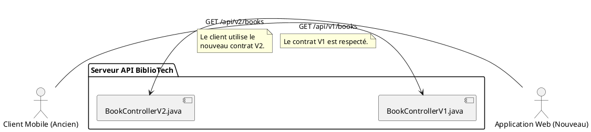

# Chapitre 6 : Le Versioning d'API - Gérer le Temps et l'Évolution

Notre API est maintenant performante et élégante. Mais une API, comme tout logiciel, est destinée à vivre et à évoluer.
Demain, une nouvelle réglementation pourrait nous imposer de changer le format d'une donnée, ou une nouvelle idée
pourrait nous amener à restructurer complètement la façon dont on gère les prêts de livres. Comment introduire ces
changements sans briser les applications de tous nos clients qui dépendent de la version actuelle ? La réponse est une
pratique professionnelle essentielle : le **versioning**.

### Objectifs Pédagogiques

À la fin de cette partie, vous serez capable de :

- Expliquer pourquoi le versioning d'API est crucial pour la maintenance à long terme.
- Distinguer un changement non-cassant ("non-breaking") d'un changement cassant ("breaking change").
- Identifier les différentes stratégies de versioning et leurs avantages/inconvénients.
- Mettre en œuvre la stratégie de versioning la plus courante (par URI) dans une application Spring Boot.
- Comprendre comment gérer la coexistence de plusieurs versions d'une API.

### Introduction : Le Contrat de Confiance

Imaginez que votre API est un **contrat de service** que vous signez avec les développeurs qui l'utilisent. Ce contrat
stipule que si un client envoie une requête `GET /api/books/{id}`, il recevra un objet JSON avec un champ `isbn` qui est
une chaîne de caractères.

Maintenant, que se passe-t-il si vous décidez unilatéralement que le champ `isbn` doit maintenant s'appeler
`internationalStandardBookNumber` ? Toutes les applications clientes qui lisaient le champ `isbn` cesseront de
fonctionner instantanément. Vous avez rompu le contrat.

Le versioning est la solution élégante à ce problème. Il vous permet de dire : "Le contrat **V1** est toujours en
vigueur et ne changera pas. Mais pour ceux qui le souhaitent, je propose un nouveau contrat, la **V2**, avec des termes
mis à jour." C'est le fondement de la stabilité et de l'évolution contrôlée.

### Qu'est-ce qu'un "Breaking Change" ?

La première étape est de savoir quand une nouvelle version est nécessaire. On ne crée une nouvelle version que pour les
**changements cassants (breaking changes)**.

- **Breaking Changes (nécessitent une nouvelle version - V2)**
    - Supprimer un champ d'une réponse JSON (`isbn` disparaît).
    - Renommer un champ (`isbn` devient `isbn13`).
    - Changer le type de données d'un champ (l'ISBN devient un objet au lieu d'une chaîne).
    - Ajouter un champ obligatoire dans une requête `POST`/`PUT`.
    - Supprimer un endpoint.
    - Changer l'URL d'un endpoint.

- **Non-Breaking Changes (peuvent être faits sur la version actuelle - V1)**
    - Ajouter un nouveau champ optionnel dans une réponse JSON.
    - Ajouter un nouvel endpoint.
    - Ajouter un nouveau paramètre de requête optionnel.
    - Modifier le contenu d'un message d'erreur.

### Stratégies de Versioning

Il existe plusieurs manières d'indiquer la version d'une API.

1. **Dans l'URI (la plus populaire)** : C'est la méthode la plus claire et la plus explicite.
    - `GET /api/v1/books`
    - `GET /api/v2/books`
    - **Avantages :** Très visible, facile à tester dans un navigateur, facile à mettre en cache.
    - **Inconvénient :** Certains puristes estiment que l'URI ne devrait pas changer car la ressource (le livre) reste
      la même.

2. **Via un en-tête HTTP personnalisé (Header)** : Techniquement plus "pur".
    - `GET /api/books` avec l'en-tête `Accept: application/vnd.bibliotech.v1+json`
    - **Avantages :** L'URI reste propre et stable.
    - **Inconvénients :** Moins visible, plus complexe à tester, nécessite une configuration côté client.

3. **Via un paramètre de requête (Query Param)** : Moins courant.
    - `GET /api/books?version=1`
    - **Inconvénients :** Encombre les URIs, peut poser des problèmes de cache.

Pour sa clarté et sa popularité, nous allons nous concentrer sur la **stratégie de versioning par URI**.

### Implémenter le Versioning par URI dans Spring Boot

C'est d'une simplicité remarquable. Il suffit de modifier l'annotation `@RequestMapping` de nos contrôleurs.

<procedure title="Passage de nos contrôleurs en V1">

Appliquons cette pratique à nos contrôleurs existants pour les établir comme étant la "V1" de notre API.

```java
// Dans BookController.java
@Tag(name = "Livres", description = "API V1 pour la gestion des livres")
@RestController
// On préfixe le chemin avec la version
@RequestMapping("/api/v1/books")
public class BookController {
    // Le reste du code ne change absolument pas
}
```

```java
// Dans AuthorController.java
@Tag(name = "Auteurs", description = "API V1 pour la gestion des auteurs")
@RestController
@RequestMapping("/api/v1/authors") // On préfixe aussi ici
public class AuthorController {
    // Le reste du code ne change absolument pas
}
```

Voilà ! Toute notre API est maintenant officiellement en version 1.

</procedure>

**Comment gérer la V2 ?**
Le jour où vous aurez besoin d'introduire un "breaking change" sur les livres, la règle d'or est : **NE MODIFIEZ PAS**
le `BookController` existant.

1. Créez un **nouveau fichier**, `BookControllerV2.java`.
2. Mappez-le à la nouvelle URI de version : `@RequestMapping("/api/v2/books")`.
3. Implémentez votre nouvelle logique dans ce contrôleur.

Les deux contrôleurs coexisteront pacifiquement. Les anciens clients continueront d'appeler la V1, tandis que les
nouveaux pourront bénéficier des améliorations de la V2.



### Exercice 13 : Mettre en place le Versioning

Votre mission est de préparer notre API pour l'avenir en établissant formellement sa version 1.

**Énoncé :**

1. Modifiez les annotations `@RequestMapping` de `BookController` et `AuthorController` pour qu'ils répondent
   respectivement sur `/api/v1/books` et `/api/v1/authors`.
2. Mettez à jour les annotations `@Tag` dans Swagger pour qu'elles mentionnent "API V1", afin de rendre la version
   visible dans la documentation.
3. Ouvrez votre fichier `requests.http` et mettez à jour toutes les URIs pour qu'elles incluent le préfixe `/v1`.
4. Lancez l'application et exécutez une de vos requêtes HTTP mises à jour (par exemple,
   `GET http://localhost:8080/api/v1/books`) pour vérifier que tout fonctionne comme avant, mais sur les nouvelles URIs.

### Correction exercice 13 {collapsible="true"}

**1 & 2. Les contrôleurs modifiés**

`BookController.java`

```java
//...

import io.swagger.v3.oas.annotations.tags.Tag;

@Tag(name = "Livres", description = "API V1 pour la gestion des livres")
@RestController
@RequestMapping("/api/v1/books")
public class BookController {
    // ...
}
```

`AuthorController.java`

```java
//...

import io.swagger.v3.oas.annotations.tags.Tag;

@Tag(name = "Auteurs", description = "API V1 pour la gestion des auteurs")
@RestController
@RequestMapping("/api/v1/authors")
public class AuthorController {
    // ...
}
```

**3. Le fichier `requests.http` mis à jour (extrait)**

```http
### Récupérer tous les livres (V1)
GET http://localhost:8080/api/v1/books
Accept: application/json

### Récupérer l'auteur avec l'ID 1 (V1)
GET http://localhost:8080/api/v1/authors/1
Accept: application/json

### Créer un nouvel auteur (V1)
POST http://localhost:8080/api/v1/authors
Content-Type: application/json

{
  "firstName": "Jules",
  "lastName": "Verne"
}
```

**4. Vérification**
En exécutant les requêtes, vous devriez obtenir les mêmes réponses qu'auparavant. En visitant
`http://localhost:8080/swagger-ui.html`, vous verrez que les endpoints sont maintenant regroupés sous les chemins
`/api/v1/...` et que les descriptions des tags ont été mises à jour.

### Auto-évaluation

1. **(QCM)** Quelle est la raison principale pour versionner une API ?
   a) Pour rendre les URIs plus jolies.
   b) Pour gérer les "breaking changes" sans impacter les clients existants.
   c) Pour améliorer les performances.
   d) C'est une obligation de Spring Boot.

2. **_ (Question ouverte)_** Qu'est-ce qu'un "breaking change" ? Donnez un exemple concret dans le contexte de notre
   entité `Book`.

3. **(QCM)** Laquelle de ces modifications est un changement non-cassant ("non-breaking") ?
   a) Renommer le champ `title` en `bookTitle` dans `BookDto`.
   b) Ajouter un nouveau champ optionnel `editor` à `BookDto`.
   c) Changer le type de l'ID de `Long` à `String`.
   d) Supprimer l'endpoint `GET /api/v1/books/{id}`.

4. **_ (Question ouverte)_** Quelle est la meilleure pratique pour introduire une V2 d'une API des livres tout en
   maintenant la V1 ?

5. **_ (Question ouverte)_** Citez un avantage et un inconvénient de la stratégie de versioning par URI.

### Conclusion

Vous maîtrisez maintenant l'un des aspects les plus importants de la vie d'une API : sa capacité à évoluer dans le temps
de manière contrôlée et professionnelle. Le versioning n'est pas une réflexion après coup, mais une stratégie à mettre
en place dès le début d'un projet. En adoptant cette pratique, vous construisez des API fiables et durables, qui
inspirent confiance à leurs utilisateurs. Vous ne livrez plus seulement du code, mais un service stable sur lequel
d'autres peuvent bâtir.

Ceci conclut notre exploration approfondie des patterns avancés. Vous êtes désormais équipé pour affronter la grande
majorité des défis que vous rencontrerez dans la conception d'API REST.