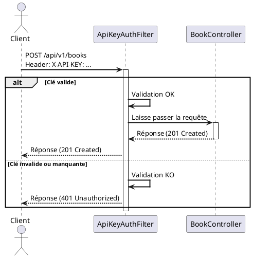

# Chapitre 6 : La Sécurisation par Clé d'API - Protéger vos Endpoints

Notre API est désormais performante, évolutive et bien structurée. Cependant, nous avons laissé la porte d'entrée grande
ouverte. N'importe qui peut créer, modifier ou supprimer des livres et des auteurs. Il est temps d'installer une
première serrure. Nous n'allons pas encore construire un coffre-fort biométrique (ce serait le rôle de Spring Security
et OAuth2), mais nous allons mettre en place un système de clé, simple et efficace, pour les opérations sensibles.

### Objectifs Pédagogiques

À la fin de cette partie, vous serez capable de :

- Comprendre le principe de l'authentification par clé d'API.
- Stocker de manière sécurisée une clé d'API dans la configuration de l'application.
- Implémenter un `Filter` Java pour intercepter les requêtes entrantes.
- Valider la présence et la conformité d'une clé d'API dans un en-tête HTTP.
- Bloquer les requêtes non autorisées avant qu'elles n'atteignent les contrôleurs.
- Appliquer cette sécurité de manière ciblée à des endpoints spécifiques.

### Introduction : Le Pass du Club Privé

Imaginez que notre API est un grand bâtiment. Les salles de lecture (`GET`) sont ouvertes au public, tout le monde peut
y entrer. Mais les bureaux où l'on ajoute ou retire des livres (`POST`, `PUT`, `DELETE`) sont un club privé. Pour y
accéder, il faut présenter une carte de membre à l'entrée. Cette carte de membre, c'est notre **clé d'API**.

La sécurité par clé d'API est un mécanisme simple : le client doit inclure une chaîne de caractères secrète (la clé)
dans chaque requête sensible. Côté serveur, un "videur" vérifiera la validité de cette clé avant de laisser la requête
passer jusqu'à nos contrôleurs. Ce "videur", en Spring Boot, sera un **filtre (Filter)**.

### 1. Stocker la Clé d'API

La première étape est de définir notre clé secrète. Ne la codez jamais en dur ! Utilisons notre fichier
`application.properties`.

<procedure title="Configuration de la clé d'API">

Ajoutez ces lignes à votre fichier `src/main/resources/application.properties` :

```properties
# -- Sécurité de l'API --
# Le nom de l'en-tête HTTP que les clients devront utiliser
bibliotech.security.api-key.header-name=X-API-KEY
# La valeur secrète de la clé d'API (dans un vrai projet, utilisez un vault !)
bibliotech.security.api-key.value=BiblioTechSecretKey123!
```

</procedure>

### 2. Le Filtre de Sécurité : Notre "Videur"

Un filtre est un composant qui intercepte une requête HTTP *avant* qu'elle n'arrive au `DispatcherServlet` de Spring (et
donc à notre contrôleur). C'est l'endroit idéal pour vérifier les autorisations.

<procedure title="Création du filtre ApiKeyAuthFilter.java">
Créez un nouveau package `fr.formation.spring.bibliotech.security` et ajoutez-y cette classe :

```java
// package fr.formation.spring.bibliotech.security;

import jakarta.servlet.*;
import jakarta.servlet.http.HttpServletRequest;
import jakarta.servlet.http.HttpServletResponse;
import org.springframework.beans.factory.annotation.Value;
import org.springframework.http.HttpStatus;
import org.springframework.stereotype.Component;

import java.io.IOException;

@Component
public class ApiKeyAuthFilter implements Filter {

    // Injection des valeurs depuis application.properties
    @Value("${bibliotech.security.api-key.header-name}")
    private String apiKeyHeaderName;

    @Value("${bibliotech.security.api-key.value}")
    private String validApiKey;

    @Override
    public void doFilter(ServletRequest request,
                         ServletResponse response,
                         FilterChain chain)
            throws IOException, ServletException {

        HttpServletRequest httpRequest = (HttpServletRequest) request;
        HttpServletResponse httpResponse = (HttpServletResponse) response;

        // 1. Extraire la clé de l'en-tête de la requête
        String apiKey = httpRequest.getHeader(apiKeyHeaderName);

        // 2. Vérifier la clé
        if (validApiKey.equals(apiKey)) {
            // Clé valide, on laisse la requête continuer son chemin
            chain.doFilter(request, response);
        } else {
            // Clé invalide ou manquante, on bloque la requête
            httpResponse.setStatus(HttpStatus.UNAUTHORIZED.value());
            httpResponse.getWriter().write("API Key invalide ou manquante.");
        }
    }
}
```

</procedure>

### 3. Enregistrer et Appliquer le Filtre

Maintenant que notre filtre existe, nous devons dire à Spring quand l'utiliser. Nous ne voulons pas protéger tous les
endpoints, seulement les plus sensibles. Pour cela, nous créons un `Bean` de configuration.

<procedure title="Configuration de l'enregistrement du filtre">
Créez une nouvelle classe `FilterConfig.java` dans votre package `config`.

```java
// package fr.formation.spring.bibliotech.config;

import fr.formation.spring.bibliotech.security.ApiKeyAuthFilter;
import org.springframework.boot.web.servlet.FilterRegistrationBean;
import org.springframework.context.annotation.Bean;
import org.springframework.context.annotation.Configuration;

@Configuration
public class FilterConfig {

    private final ApiKeyAuthFilter apiKeyAuthFilter;

    public FilterConfig(ApiKeyAuthFilter apiKeyAuthFilter) {
        this.apiKeyAuthFilter = apiKeyAuthFilter;
    }

    @Bean
    public FilterRegistrationBean<ApiKeyAuthFilter> registerApiKeyFilter() {
        FilterRegistrationBean<ApiKeyAuthFilter> registration = new FilterRegistrationBean<>();
        registration.setFilter(apiKeyAuthFilter);

        // Appliquer ce filtre uniquement aux endpoints de création,
        // modification et suppression des livres.
        registration.addUrlPatterns(
                "/api/v1/books",      // Protège POST
                "/api/v1/books/*"     // Protège PUT, DELETE
        );
        return registration;
    }
}
```

</procedure>

<note title="Comprendre les URL Patterns">

<ul>
    <li><code>/api/v1/books</code> : Cible exactement cette URL, ce qui correspond à notre endpoint <code>POST</code>.</li>
    <li><code>/api/v1/books/*</code> : Cible toutes les URLs qui commencent par <code>/api/v1/books/</code>, ce qui protège nos endpoints <code>GET /{id}</code>, <code>PUT /{id}</code> et <code>DELETE /{id}</code>. Nous pourrions affiner cela si nous voulions laisser le <code>GET /{id}</code> public.</li>
</ul>

</note>



### Exercice 14 : Sécuriser les Opérations sur les Auteurs

Vous avez sécurisé les opérations d'écriture sur les livres. Maintenant, faites de même pour les auteurs.

**Énoncé :**

1. Le besoin est de sécuriser uniquement les opérations qui modifient les données des auteurs : `POST`, `PUT`, `DELETE`.
   Les opérations de lecture (`GET`) doivent rester publiques et accessibles sans clé d'API.
2. Modifiez la configuration de votre filtre (`FilterConfig.java`) pour ajouter les URL patterns nécessaires afin de
   protéger les endpoints d'écriture du `AuthorController`.
3. Testez votre configuration :
    - Envoyez une requête `GET /api/v1/authors`. Elle doit réussir sans clé.
    - Envoyez une requête `POST /api/v1/authors` sans la clé `X-API-KEY`. Elle doit échouer avec une erreur
      `401 Unauthorized`.
    - Renvoyez la même requête `POST` en ajoutant l'en-tête `X-API-KEY: BiblioTechSecretKey123!`. Elle doit maintenant
      réussir.

### Correction exercice 14 {collapsible="true"}

**Solution dans `FilterConfig.java`**

La clé est d'ajouter les bons patterns d'URL au `FilterRegistrationBean`.

```java
// package fr.formation.spring.bibliotech.config;

import fr.formation.spring.bibliotech.security.ApiKeyAuthFilter;
import org.springframework.boot.web.servlet.FilterRegistrationBean;
import org.springframework.context.annotation.Bean;
import org.springframework.context.annotation.Configuration;

@Configuration
public class FilterConfig {

    private final ApiKeyAuthFilter apiKeyAuthFilter;

    public FilterConfig(ApiKeyAuthFilter apiKeyAuthFilter) {
        this.apiKeyAuthFilter = apiKeyAuthFilter;
    }

    @Bean
    public FilterRegistrationBean<ApiKeyAuthFilter> registerApiKeyFilter() {
        FilterRegistrationBean<ApiKeyAuthFilter> registration = new FilterRegistrationBean<>();
        registration.setFilter(apiKeyAuthFilter);

        // On ajoute les patterns pour les auteurs aux patterns existants
        registration.addUrlPatterns(
                // Patterns pour les Livres (déjà présents)
                "/api/v1/books",
                "/api/v1/books/*",

                // Nouveaux patterns pour les Auteurs
                "/api/v1/authors",    // Protège POST /api/v1/authors
                "/api/v1/authors/*"   // Protège PUT et DELETE /api/v1/authors/{id}
        );
        return registration;
    }
}
```

*Note : Pour être plus précis et laisser `GET /.../{id}` public, il faudrait mapper le filtre à des verbes HTTP
spécifiques, ce qui est une configuration plus avancée. Pour l'instant, cette solution protège toutes les écritures.*

**Requêtes de test dans `requests.http`**

```http
### GET Auteurs (doit fonctionner sans clé)
GET http://localhost:8080/api/v1/authors

### POST Auteur sans clé (doit échouer avec 401)
POST http://localhost:8080/api/v1/authors
Content-Type: application/json

{
  "firstName": "Isaac",
  "lastName": "Asimov"
}

### POST Auteur avec clé (doit réussir)
POST http://localhost:8080/api/v1/authors
Content-Type: application/json
X-API-KEY: BiblioTechSecretKey123!

{
  "firstName": "Isaac",
  "lastName": "Asimov"
}
```

### Conclusion

Vous venez d'implémenter votre premier mécanisme de sécurité ! En utilisant un simple filtre, vous avez appris à
intercepter des requêtes et à prendre des décisions avant même que votre logique métier ne soit invoquée. C'est un
pattern extrêmement puissant.

La sécurité par clé d'API est une excellente première ligne de défense, parfaite pour contrôler l'accès entre des
services serveurs ou pour des API publiques avec des quotas d'utilisation. Gardez cependant à l'esprit que ce n'est
qu'un début. Pour des applications gérant des utilisateurs finaux, avec des notions de rôles et de permissions
complexes, vous vous tournerez naturellement vers des solutions plus robustes comme **Spring Security**, qui est la
prochaine étape logique de votre parcours d'apprentissage de la sécurité.