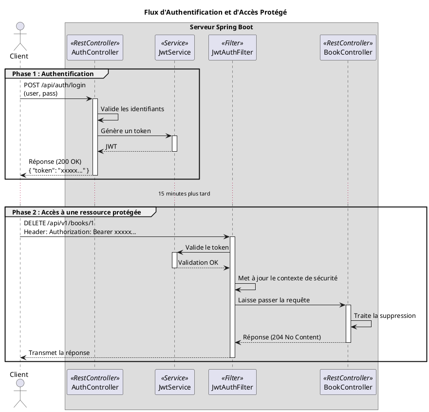

# Chapitre 5 : Sécurisation de l'API avec JWT - L'Authentification Moderne

Nous avons mis en place une première serrure avec une clé d'API. C'est efficace, mais c'est une clé unique pour tout le
monde. Comment faire si nous voulons savoir **qui** utilise notre API ? Comment donner des droits différents à un simple
lecteur et à un bibliothécaire administrateur ? Il nous faut une carte d'identité infalsifiable, pas juste un
passe-partout. Bienvenue dans le monde de l'authentification par **JSON Web Token (JWT)**.

### Objectifs Pédagogiques

À la fin de cette partie, vous serez capable de :

- Comprendre la structure et le fonctionnement d'un JSON Web Token (JWT).
- Intégrer Spring Security dans votre projet pour une gestion robuste de la sécurité.
- Créer un endpoint d'authentification qui délivre un JWT en échange d'un identifiant et d'un mot de passe.
- Configurer une chaîne de filtres de sécurité pour valider les JWTs sur les requêtes entrantes.
- Protéger des endpoints spécifiques et n'autoriser leur accès qu'aux utilisateurs authentifiés.

### Introduction : La Carte d'Identité Numérique

La clé d'API était un passe de club privé : elle prouve que vous avez le droit d'entrer, mais pas qui vous êtes. Un JWT,
c'est différent. C'est une **carte d'identité numérique**. Quand vous la présentez, le serveur sait non seulement que
vous avez le droit d'entrer (elle est valide), mais aussi que vous êtes, par exemple, "Jean Dupont, Administrateur".

L'avantage majeur est qu'elle est **stateless** et **infalsifiable**. Le serveur n'a pas besoin de garder une copie de
votre session. Toutes les informations nécessaires (qui vous êtes, vos droits, sa date d'expiration) sont contenues dans
le token lui-même, et une signature cryptographique garantit que personne ne l'a modifié en chemin.

### 1. Qu'est-ce qu'un JWT ?

Un JWT est une chaîne de caractères compacte, composée de trois parties séparées par des points : `xxxxx.yyyyy.zzzzz`

1. **Header (En-tête)** : Contient les métadonnées. Typiquement, le type de token (`JWT`) et l'algorithme de signature
   utilisé (`HS256`).
2. **Payload (Données utiles)** : Contient les "claims" (les informations). C'est le cœur du token. On y trouve des
   informations standardisées comme `sub` (le sujet, ex: l'identifiant de l'utilisateur), `exp` (la date d'expiration),
   et on peut y ajouter des informations personnalisées comme les rôles de l'utilisateur.
3. **Signature** : C'est le sceau de sécurité. Elle est calculée à partir du Header, du Payload et d'une **clé secrète**
   connue uniquement du serveur. Si quelqu'un modifie le Header ou le Payload, la signature ne correspondra plus, et le
   token sera rejeté.

### 2. Intégration de Spring Security et JWT

Pour gérer tout cela, nous avons besoin de deux outils : Spring Security et une bibliothèque pour manipuler les JWTs.

<procedure title="Mise à jour du `pom.xml`">
Ajoutez les dépendances suivantes à votre projet.

```xml
<!-- Dans la section <dependencies> -->

<!-- Spring Boot Starter pour la sécurité -->
<dependency>
    <groupId>org.springframework.boot</groupId>
    <artifactId>spring-boot-starter-security</artifactId>
</dependency>

        <!-- Bibliothèque pour la création et validation des JWTs -->
<dependency>
<groupId>io.jsonwebtoken</groupId>
<artifactId>jjwt-api</artifactId>
<version>0.11.5</version>
</dependency>
<dependency>
<groupId>io.jsonwebtoken</groupId>
<artifactId>jjwt-impl</artifactId>
<version>0.11.5</version>
<scope>runtime</scope>
</dependency>
<dependency>
<groupId>io.jsonwebtoken</groupId>
<artifactId>jjwt-jackson</artifactId>
<version>0.11.5</version>
<scope>runtime</scope>
</dependency>
```

Désormais, tous vos endpoints sont protégés par défaut ! Si vous relancez l'application, vous ne pourrez plus y accéder.
Nous allons maintenant configurer cet accès.
</procedure>

### 3. La Chaîne de Configuration de Sécurité

C'est ici que nous allons définir les règles du jeu : quels endpoints sont publics, lesquels sont protégés, et comment
nous validons les tokens.

<procedure title="Création de la classe `SecurityConfig.java`">
Créez cette classe dans votre package `config`.

```java
// package fr.formation.spring.bibliotech.config;

import org.springframework.context.annotation.Bean;
import org.springframework.context.annotation.Configuration;
import org.springframework.security.config.annotation.web.builders.HttpSecurity;
import org.springframework.security.config.annotation.web.configuration.EnableWebSecurity;
import org.springframework.security.config.http.SessionCreationPolicy;
import org.springframework.security.core.userdetails.User;
import org.springframework.security.core.userdetails.UserDetails;
import org.springframework.security.core.userdetails.UserDetailsService;
import org.springframework.security.crypto.bcrypt.BCryptPasswordEncoder;
import org.springframework.security.crypto.password.PasswordEncoder;
import org.springframework.security.provisioning.InMemoryUserDetailsManager;
import org.springframework.security.web.SecurityFilterChain;

@Configuration
@EnableWebSecurity
public class SecurityConfig {

    @Bean
    public SecurityFilterChain securityFilterChain(HttpSecurity http) throws Exception {
        http
                // Désactiver CSRF car nous utilisons une API stateless
                .csrf(csrf -> csrf.disable())

                // Définir la politique de gestion de session comme stateless
                .sessionManagement(session ->
                        session.sessionCreationPolicy(SessionCreationPolicy.STATELESS))

                // Définir les autorisations pour les requêtes HTTP
                .authorizeHttpRequests(auth -> auth
                        // Autoriser l'accès public aux endpoints de documentation
                        .requestMatchers("/swagger-ui/**", "/v3/api-docs/**").permitAll()
                        // Autoriser l'accès public à la console H2
                        .requestMatchers("/h2-console/**").permitAll()
                        // Pour l'instant, autoriser les autres, nous affinerons plus tard
                        .anyRequest().permitAll()
                );

        // Permettre l'affichage de la console H2 dans un iFrame
        http.headers(headers -> headers.frameOptions(frame -> frame.sameOrigin()));

        return http.build();
    }

    // Bean pour encoder les mots de passe
    @Bean
    public PasswordEncoder passwordEncoder() {
        return new BCryptPasswordEncoder();
    }

    // Bean pour définir des utilisateurs en mémoire (pour l'exemple)
    @Bean
    public UserDetailsService userDetailsService() {
        UserDetails admin = User.builder()
                .username("admin")
                .password(passwordEncoder().encode("password123"))
                .roles("ADMIN", "USER")
                .build();

        UserDetails user = User.builder()
                .username("user")
                .password(passwordEncoder().encode("password"))
                .roles("USER")
                .build();

        return new InMemoryUserDetailsManager(admin, user);
    }
}
```

</procedure>

<note class="alert alert-info" title="Pourquoi des utilisateurs en mémoire ?">
<p>
Dans une application réelle, vous créeriez une entité <code>User</code> en base de données et implémenteriez l'interface <code>UserDetailsService</code> pour charger les utilisateurs depuis votre <code>UserRepository</code>. Pour ce cours, utiliser des utilisateurs en mémoire (<code>InMemoryUserDetailsManager</code>) nous permet de nous concentrer sur la logique JWT sans complexifier le modèle de données.
</p>
</note>

Pour l'instant, cette configuration ne fait pas grand-chose de plus que de définir des utilisateurs. Nous allons
maintenant créer un endpoint pour s'authentifier et un filtre pour valider les tokens.

### 4. Le Processus d'Authentification

Nous avons besoin :

1. D'un **endpoint** `/api/auth/login` pour recevoir les identifiants.
2. D'un **service** `JwtService` pour générer les tokens.
3. D'un **filtre** `JwtAuthFilter` pour valider les tokens sur les autres requêtes.

(Pour des raisons de concision, le code complet de `JwtService` et `JwtAuthFilter` est complexe. Nous présentons ici
leur rôle et leur intégration, qui sont les points clés de l'architecture).

**L'idée générale est la suivante :**

1. Le client envoie une requête `POST /api/auth/login` avec un `username` et `password`.
2. Un contrôleur d'authentification utilise l'`AuthenticationManager` de Spring pour vérifier ces identifiants.
3. Si l'authentification réussit, il appelle le `JwtService` pour créer un token.
4. Il retourne ce token au client.

**Ensuite, pour chaque requête sur un endpoint protégé :**

1. Le `JwtAuthFilter` intercepte la requête.
2. Il extrait le token de l'en-tête `Authorization: Bearer <token>`.
3. Il utilise le `JwtService` pour valider la signature et l'expiration du token.
4. S'il est valide, il crée un objet d'authentification et le place dans le `SecurityContextHolder`. Spring Security
   sait alors que la requête est valide et la laisse passer jusqu'au contrôleur.



### Exercice 15 : Mettre en Place une Règle de Sécurité

Nous n'allons pas implémenter tout le flux JWT qui est assez long, mais nous allons faire la partie la plus importante :
modifier la configuration de sécurité pour protéger un endpoint.

**Énoncé :**

1. Assurez-vous d'avoir la dépendance `spring-boot-starter-security` dans votre `pom.xml` et la classe `SecurityConfig`
   de base (donnée ci-dessus) dans votre projet.
2. Le but est de protéger les opérations de suppression (`DELETE`) sur les livres, en n'autorisant que les utilisateurs
   ayant le rôle `ADMIN`.
3. Modifiez la méthode `securityFilterChain` dans `SecurityConfig.java`. Changez la section `.authorizeHttpRequests()`
   pour y ajouter une règle spécifique pour le verbe `DELETE` sur `/api/v1/books/**`.
4. La nouvelle règle doit stipuler que ces requêtes nécessitent le rôle `ADMIN` (`.hasRole("ADMIN")`). Les autres
   requêtes peuvent rester publiques pour le moment (`.anyRequest().permitAll()`).
5. Relancez l'application. Essayez d'envoyer une requête `DELETE /api/v1/books/1`. Vous devriez recevoir une erreur
   `401 Unauthorized` ou `403 Forbidden`, car vous n'êtes pas authentifié en tant qu'administrateur.

### Correction exercice 15 {collapsible="true"}

**Solution dans `SecurityConfig.java`**

Il faut insérer la nouvelle règle de sécurité avant le `anyRequest()`.

```java
// package fr.formation.spring.bibliotech.config;
// ... imports

import org.springframework.http.HttpMethod;

@Configuration
@EnableWebSecurity
public class SecurityConfig {

    @Bean
    public SecurityFilterChain securityFilterChain(HttpSecurity http) throws Exception {
        http
                .csrf(csrf -> csrf.disable())
                .sessionManagement(session ->
                        session.sessionCreationPolicy(SessionCreationPolicy.STATELESS))

                .authorizeHttpRequests(auth -> auth
                        // Endpoints publics
                        .requestMatchers("/swagger-ui/**", "/v3/api-docs/**").permitAll()
                        .requestMatchers("/h2-console/**").permitAll()

                        // Nouvelle règle de sécurité pour la suppression des livres
                        .requestMatchers(HttpMethod.DELETE, "/api/v1/books/**")
                        .hasRole("ADMIN")

                        // Le reste des requêtes reste public pour l'instant
                        .anyRequest().permitAll()
                );

        http.headers(headers -> headers.frameOptions(frame -> frame.sameOrigin()));

        return http.build();
    }
    // ... reste de la classe (PasswordEncoder, UserDetailsService)
}
```

**Vérification**

Lorsque vous envoyez la requête `DELETE /api/v1/books/1` avec un client HTTP, le serveur répondra maintenant par une
erreur `401 Unauthorized` (si aucune authentification n'est fournie) ou `403 Forbidden` (si vous étiez authentifié mais
sans le rôle `ADMIN`). Spring Security a bien intercepté et bloqué la requête, comme demandé.

### Conclusion

Vous avez effleuré le framework de sécurité le plus puissant et le plus complet de l'écosystème Java. L'intégration de
la sécurité avec JWT est une étape complexe mais indispensable pour la majorité des API modernes. Vous comprenez
maintenant l'architecture de base : un endpoint pour s'authentifier, et un filtre pour vérifier l'identité sur chaque
requête protégée.

Même si nous n'avons pas écrit chaque ligne de code du flux JWT, vous avez en main le plan d'architecte. Vous êtes prêt
à approfondir le sujet en implémentant les services et filtres nécessaires, ce qui constitue une compétence clé pour
tout développeur back-end senior.