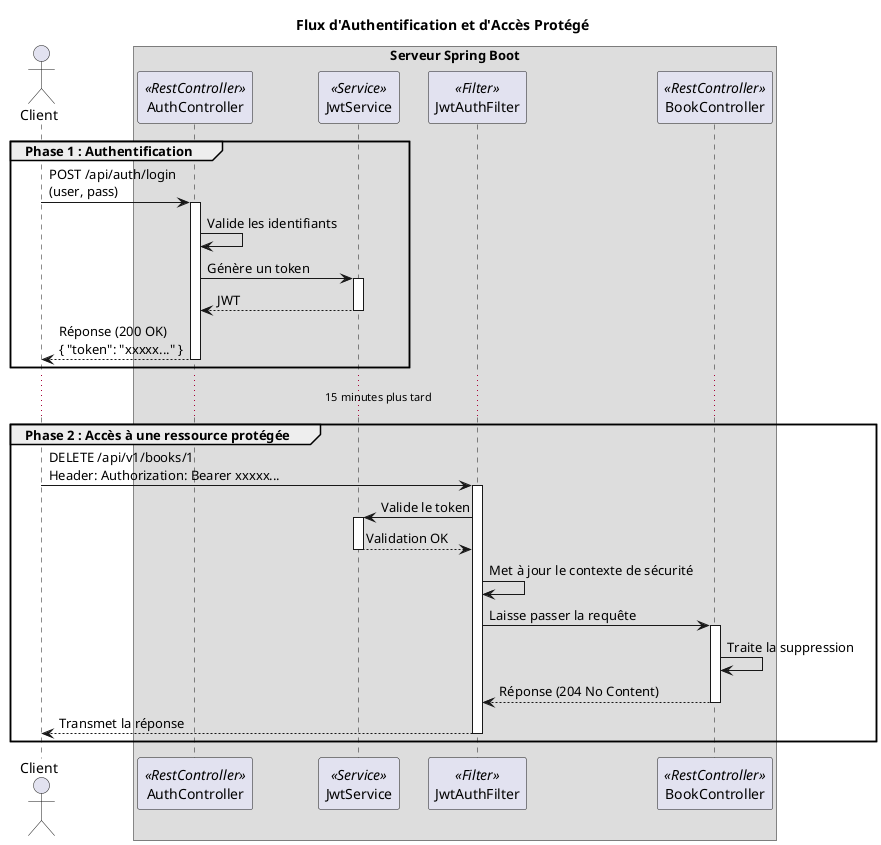

# Chapitre 5 : Sécurisation de l'API avec JWT - L'Authentification Moderne

Nous avons mis en place une première serrure avec une clé d'API. C'est efficace, mais c'est une clé unique pour tout le
monde. Comment faire si nous voulons savoir **qui** utilise notre API ? Comment donner des droits différents à un simple
lecteur et à un bibliothécaire administrateur ? Il nous faut une carte d'identité infalsifiable, pas juste un
passe-partout. Bienvenue dans le monde de l'authentification par **JSON Web Token (JWT)**.

### Objectifs Pédagogiques

À la fin de cette partie, vous serez capable de :

- Comprendre la structure et le fonctionnement d'un JSON Web Token (JWT).
- Intégrer Spring Security dans votre projet pour une gestion robuste de la sécurité.
- Créer un endpoint d'authentification qui délivre un JWT en échange d'un identifiant et d'un mot de passe.
- Configurer une chaîne de filtres de sécurité pour valider les JWTs sur les requêtes entrantes.
- Protéger des endpoints spécifiques et n'autoriser leur accès qu'aux utilisateurs authentifiés.

### Introduction : La Carte d'Identité Numérique

La clé d'API était un passe de club privé : elle prouve que vous avez le droit d'entrer, mais pas qui vous êtes. Un JWT,
c'est différent. C'est une **carte d'identité numérique**. Quand vous la présentez, le serveur sait non seulement que
vous avez le droit d'entrer (elle est valide), mais aussi que vous êtes, par exemple, "Jean Dupont, Administrateur".

L'avantage majeur est qu'elle est **stateless** et **infalsifiable**. Le serveur n'a pas besoin de garder une copie de
votre session. Toutes les informations nécessaires (qui vous êtes, vos droits, sa date d'expiration) sont contenues dans
le token lui-même, et une signature cryptographique garantit que personne ne l'a modifié en chemin.

### 1. Qu'est-ce qu'un JWT ?

Un JWT est une chaîne de caractères compacte, composée de trois parties séparées par des points : `xxxxx.yyyyy.zzzzz`

1. **Header (En-tête)** : Contient les métadonnées. Typiquement, le type de token (`JWT`) et l'algorithme de signature
   utilisé (`HS256`).
2. **Payload (Données utiles)** : Contient les "claims" (les informations). C'est le cœur du token. On y trouve des
   informations standardisées comme `sub` (le sujet, ex: l'identifiant de l'utilisateur), `exp` (la date d'expiration),
   et on peut y ajouter des informations personnalisées comme les rôles de l'utilisateur.
3. **Signature** : C'est le sceau de sécurité. Elle est calculée à partir du Header, du Payload et d'une **clé secrète**
   connue uniquement du serveur. Si quelqu'un modifie le Header ou le Payload, la signature ne correspondra plus, et le
   token sera rejeté.

### 2. Intégration de Spring Security et JWT

Pour gérer tout cela, nous avons besoin de deux outils : Spring Security et une bibliothèque pour manipuler les JWTs.

<procedure title="Mise à jour du `pom.xml`">
Ajoutez les dépendances suivantes à votre projet.

```xml
<!-- Dans la section <dependencies> -->

<!-- Spring Boot Starter pour la sécurité -->
<dependency>
    <groupId>org.springframework.boot</groupId>
    <artifactId>spring-boot-starter-security</artifactId>
</dependency>

        <!-- Bibliothèque pour la création et validation des JWTs -->
<dependency>
<groupId>io.jsonwebtoken</groupId>
<artifactId>jjwt-api</artifactId>
<version>0.11.5</version>
</dependency>
<dependency>
<groupId>io.jsonwebtoken</groupId>
<artifactId>jjwt-impl</artifactId>
<version>0.11.5</version>
<scope>runtime</scope>
</dependency>
<dependency>
<groupId>io.jsonwebtoken</groupId>
<artifactId>jjwt-jackson</artifactId>
<version>0.11.5</version>
<scope>runtime</scope>
</dependency>
```

Désormais, tous vos endpoints sont protégés par défaut ! Si vous relancez l'application, vous ne pourrez plus y accéder.
Nous allons maintenant configurer cet accès.
</procedure>

### 3. La Chaîne de Configuration de Sécurité

C'est ici que nous allons définir les règles du jeu : quels endpoints sont publics, lesquels sont protégés, et comment
nous validons les tokens.

<procedure title="Création de la classe `SecurityConfig.java`">
Créez cette classe dans votre package `config`.

```java
// package fr.formation.spring.bibliotech.config;

import org.springframework.context.annotation.Bean;
import org.springframework.context.annotation.Configuration;
import org.springframework.security.config.annotation.web.builders.HttpSecurity;
import org.springframework.security.config.annotation.web.configuration.EnableWebSecurity;
import org.springframework.security.config.http.SessionCreationPolicy;
import org.springframework.security.core.userdetails.User;
import org.springframework.security.core.userdetails.UserDetails;
import org.springframework.security.core.userdetails.UserDetailsService;
import org.springframework.security.crypto.bcrypt.BCryptPasswordEncoder;
import org.springframework.security.crypto.password.PasswordEncoder;
import org.springframework.security.provisioning.InMemoryUserDetailsManager;
import org.springframework.security.web.SecurityFilterChain;

@Configuration
@EnableWebSecurity
public class SecurityConfig {

    @Bean
    public SecurityFilterChain securityFilterChain(HttpSecurity http) throws Exception {
        http
                // Désactiver CSRF car nous utilisons une API stateless
                .csrf(csrf -> csrf.disable())

                // Définir la politique de gestion de session comme stateless
                .sessionManagement(session ->
                        session.sessionCreationPolicy(SessionCreationPolicy.STATELESS))

                // Définir les autorisations pour les requêtes HTTP
                .authorizeHttpRequests(auth -> auth
                        // Autoriser l'accès public aux endpoints de documentation
                        .requestMatchers("/swagger-ui/**", "/v3/api-docs/**").permitAll()
                        // Autoriser l'accès public à la console H2
                        .requestMatchers("/h2-console/**").permitAll()
                        // Pour l'instant, autoriser les autres, nous affinerons plus tard
                        .anyRequest().permitAll()
                );

        // Permettre l'affichage de la console H2 dans un iFrame
        http.headers(headers -> headers.frameOptions(frame -> frame.sameOrigin()));

        return http.build();
    }

    // Bean pour encoder les mots de passe
    @Bean
    public PasswordEncoder passwordEncoder() {
        return new BCryptPasswordEncoder();
    }

    // Bean pour définir des utilisateurs en mémoire (pour l'exemple)
    @Bean
    public UserDetailsService userDetailsService() {
        UserDetails admin = User.builder()
                .username("admin")
                .password(passwordEncoder().encode("password123"))
                .roles("ADMIN", "USER")
                .build();

        UserDetails user = User.builder()
                .username("user")
                .password(passwordEncoder().encode("password"))
                .roles("USER")
                .build();

        return new InMemoryUserDetailsManager(admin, user);
    }
}
```

</procedure>

<note class="alert alert-info" title="Pourquoi des utilisateurs en mémoire ?">
<p>
Dans une application réelle, vous créeriez une entité <code>User</code> en base de données et implémenteriez l'interface <code>UserDetailsService</code> pour charger les utilisateurs depuis votre <code>UserRepository</code>. Pour ce cours, utiliser des utilisateurs en mémoire (<code>InMemoryUserDetailsManager</code>) nous permet de nous concentrer sur la logique JWT sans complexifier le modèle de données.
</p>
</note>

Pour l'instant, cette configuration ne fait pas grand-chose de plus que de définir des utilisateurs. Nous allons
maintenant créer un endpoint pour s'authentifier et un filtre pour valider les tokens.

### 4. Le Processus d'Authentification

Nous avons besoin :

1. D'un **endpoint** `/api/auth/login` pour recevoir les identifiants.
2. D'un **service** `JwtService` pour générer les tokens.
3. D'un **filtre** `JwtAuthFilter` pour valider les tokens sur les autres requêtes.

<!--
(Pour des raisons de concision, le code complet de `JwtService` et `JwtAuthFilter` est complexe. Nous présentons ici
leur rôle et leur intégration, qui sont les points clés de l'architecture).
-->

**L'idée générale est la suivante :**

1. Le client envoie une requête `POST /api/auth/login` avec un `username` et `password`.
2. Un contrôleur d'authentification utilise l'`AuthenticationManager` de Spring pour vérifier ces identifiants.
3. Si l'authentification réussit, il appelle le `JwtService` pour créer un token.
4. Il retourne ce token au client.

**Ensuite, pour chaque requête sur un endpoint protégé :**

1. Le `JwtAuthFilter` intercepte la requête.
2. Il extrait le token de l'en-tête `Authorization: Bearer <token>`.
3. Il utilise le `JwtService` pour valider la signature et l'expiration du token.
4. S'il est valide, il crée un objet d'authentification et le place dans le `SecurityContextHolder`. Spring Security
   sait alors que la requête est valide et la laisse passer jusqu'au contrôleur.



### 5. Le code de sécurité complet

Pour rendre le système fonctionnel, nous avons besoin de trois composants principaux :

1. **`JwtService`** : Une classe de service responsable de la création et de la validation des tokens.
2. **`JwtAuthFilter`** : Un filtre qui intercepte chaque requête, extrait le token et met à jour le contexte de
   sécurité.
3. **`AuthController`** : Un contrôleur avec un endpoint `/login` pour démarrer le processus.

#### 5.1. Configuration des Propriétés JWT

D'abord, ajoutons les propriétés de configuration pour notre token dans `application.properties`.

```properties
# -- Sécurité de l'API avec JWT --
# Clé secrète pour signer les tokens. DOIT être longue et complexe en production.
# Pour la générer, on peut utiliser un encodage Base64 d'une chaîne aléatoire.
bibliotech.security.jwt.secret-key=bXktMzJtYl9zZWNyZXQtYmlibGlvdGVjaC1hcGktc2VjcmV0LWtleS1pcy1zdXBlci1sb25nLWFuZC1zZWN1cmU=
# Durée de validité du token en millisecondes (ici, 1 heure)
bibliotech.security.jwt.expiration-time=3600000
```

<warning class="alert alert-warning" title="Clé Secrète en Production">
<p>
La clé secrète est le bien le plus précieux de votre API. Ne la stockez jamais en clair dans votre code ou dans un fichier de configuration public. Utilisez des variables d'environnement ou un service de gestion des secrets comme HashiCorp Vault ou AWS Secrets Manager.
</p>
</warning>

---

#### 5.2. Le Service JWT (`JwtService.java`)

Ce service encapsule toute la logique de manipulation des tokens.

<procedure title="Création de JwtService.java">
Créez cette classe dans le package `fr.formation.spring.bibliotech.security`.

```java
package fr.formation.spring.bibliotech.security;

import io.jsonwebtoken.Claims;
import io.jsonwebtoken.Jwts;
import io.jsonwebtoken.SignatureAlgorithm;
import io.jsonwebtoken.io.Decoders;
import io.jsonwebtoken.security.Keys;
import org.springframework.beans.factory.annotation.Value;
import org.springframework.security.core.GrantedAuthority;
import org.springframework.security.core.userdetails.UserDetails;
import org.springframework.stereotype.Service;

import java.security.Key;
import java.util.Date;
import java.util.HashMap;
import java.util.Map;
import java.util.function.Function;
import java.util.stream.Collectors;

@Service
public class JwtService {

    @Value("${bibliotech.security.jwt.secret-key}")
    private String secretKey;

    @Value("${bibliotech.security.jwt.expiration-time}")
    private long jwtExpiration;

    // Extrait le nom d'utilisateur (subject) du token
    public String extractUsername(String token) {
        return extractClaim(token, Claims::getSubject);
    }

    // Génère un token à partir des détails de l'utilisateur
    public String generateToken(UserDetails userDetails) {
        return generateToken(new HashMap<>(), userDetails);
    }

    // Génère un token avec des claims supplémentaires
    public String generateToken(Map<String, Object> extraClaims, UserDetails userDetails) {
        // Ajoute les rôles de l'utilisateur dans les claims du token
        extraClaims.put("roles", userDetails.getAuthorities().stream()
                .map(GrantedAuthority::getAuthority).collect(Collectors.toList()));

        return Jwts.builder()
                .setClaims(extraClaims)
                .setSubject(userDetails.getUsername())
                .setIssuedAt(new Date(System.currentTimeMillis()))
                .setExpiration(new Date(System.currentTimeMillis() + jwtExpiration))
                .signWith(getSignInKey(), SignatureAlgorithm.HS256)
                .compact();
    }

    // Vérifie si le token est valide pour un utilisateur donné
    public boolean isTokenValid(String token, UserDetails userDetails) {
        final String username = extractUsername(token);
        return (username.equals(userDetails.getUsername())) && !isTokenExpired(token);
    }

    // Vérifie si le token est expiré
    private boolean isTokenExpired(String token) {
        return extractExpiration(token).before(new Date());
    }

    // Extrait la date d'expiration du token
    private Date extractExpiration(String token) {
        return extractClaim(token, Claims::getExpiration);
    }

    // Méthode générique pour extraire un claim spécifique
    public <T> T extractClaim(String token, Function<Claims, T> claimsResolver) {
        final Claims claims = extractAllClaims(token);
        return claimsResolver.apply(claims);
    }

    // Extrait tous les claims du token
    private Claims extractAllClaims(String token) {
        return Jwts.parserBuilder()
                .setSigningKey(getSignInKey())
                .build()
                .parseClaimsJws(token)
                .getBody();
    }

    // Récupère la clé de signature à partir de la clé secrète en Base64
    private Key getSignInKey() {
        byte[] keyBytes = Decoders.BASE64.decode(secretKey);
        return Keys.hmacShaKeyFor(keyBytes);
    }
}
```

</procedure>

---

#### 5.3. Le Filtre d'Authentification JWT (`JwtAuthFilter.java`)

Ce filtre s'exécute une fois par requête pour valider le token et établir l'identité de l'utilisateur.

<procedure title="Création de JwtAuthFilter.java">
Créez cette classe dans le package `fr.formation.spring.bibliotech.security`.

```java
package fr.formation.spring.bibliotech.security;

import jakarta.servlet.FilterChain;
import jakarta.servlet.ServletException;
import jakarta.servlet.http.HttpServletRequest;
import jakarta.servlet.http.HttpServletResponse;
import org.springframework.lang.NonNull;
import org.springframework.security.authentication.UsernamePasswordAuthenticationToken;
import org.springframework.security.core.context.SecurityContextHolder;
import org.springframework.security.core.userdetails.UserDetails;
import org.springframework.security.core.userdetails.UserDetailsService;
import org.springframework.security.web.authentication.WebAuthenticationDetailsSource;
import org.springframework.stereotype.Component;
import org.springframework.web.filter.OncePerRequestFilter;

import java.io.IOException;

@Component
public class JwtAuthFilter extends OncePerRequestFilter {

    private final JwtService jwtService;
    private final UserDetailsService userDetailsService;

    public JwtAuthFilter(JwtService jwtService, UserDetailsService userDetailsService) {
        this.jwtService = jwtService;
        this.userDetailsService = userDetailsService;
    }

    @Override
    protected void doFilterInternal(
            @NonNull HttpServletRequest request,
            @NonNull HttpServletResponse response,
            @NonNull FilterChain filterChain
    ) throws ServletException, IOException {

        final String authHeader = request.getHeader("Authorization");
        final String jwt;
        final String username;

        // Si l'en-tête est absent ou ne commence pas par "Bearer ", on passe au filtre suivant
        if (authHeader == null || !authHeader.startsWith("Bearer ")) {
            filterChain.doFilter(request, response);
            return;
        }

        // Extrait le token (après "Bearer ")
        jwt = authHeader.substring(7);
        username = jwtService.extractUsername(jwt);

        // Si on a un username mais que l'utilisateur n'est pas encore authentifié
        if (username != null && SecurityContextHolder.getContext().getAuthentication() == null) {
            UserDetails userDetails = this.userDetailsService.loadUserByUsername(username);

            // Si le token est valide
            if (jwtService.isTokenValid(jwt, userDetails)) {
                // On crée un objet d'authentification
                UsernamePasswordAuthenticationToken authToken = new UsernamePasswordAuthenticationToken(
                        userDetails,
                        null, // On ne stocke pas les mots de passe
                        userDetails.getAuthorities()
                );
                authToken.setDetails(
                        new WebAuthenticationDetailsSource().buildDetails(request)
                );
                // On met à jour le SecurityContextHolder
                SecurityContextHolder.getContext().setAuthentication(authToken);
            }
        }
        // On continue la chaîne des filtres
        filterChain.doFilter(request, response);
    }
}
```

</procedure>

---

#### 5.4. Le Contrôleur d'Authentification (`AuthController.java`)

Ce contrôleur fournit l'endpoint `/login` public pour que les utilisateurs puissent obtenir un token.

<procedure title="Création de AuthController.java">
Créez un nouveau package `fr.formation.spring.bibliotech.api.auth` et placez-y cette classe et ses DTOs.

**DTOs pour l'authentification**

```java
// AuthRequest.java
package fr.formation.spring.bibliotech.api.auth;

import lombok.Data;

@Data
public class AuthRequest {
    private String username;
    private String password;
}
```

```java
// AuthResponse.java
package fr.formation.spring.bibliotech.api.auth;

import lombok.AllArgsConstructor;
import lombok.Data;

@Data
@AllArgsConstructor
public class AuthResponse {
    private String token;
}
```

**Le contrôleur**

```java
// AuthController.java
package fr.formation.spring.bibliotech.api.auth;

import fr.formation.spring.bibliotech.security.JwtService;
import org.springframework.security.authentication.AuthenticationManager;
import org.springframework.security.authentication.UsernamePasswordAuthenticationToken;
import org.springframework.security.core.Authentication;
import org.springframework.security.core.userdetails.UserDetails;
import org.springframework.web.bind.annotation.PostMapping;
import org.springframework.web.bind.annotation.RequestBody;
import org.springframework.web.bind.annotation.RequestMapping;
import org.springframework.web.bind.annotation.RestController;

@RestController
@RequestMapping("/api/auth")
public class AuthController {

    private final AuthenticationManager authenticationManager;
    private final JwtService jwtService;

    public AuthController(AuthenticationManager authenticationManager, JwtService jwtService) {
        this.authenticationManager = authenticationManager;
        this.jwtService = jwtService;
    }

    @PostMapping("/login")
    public AuthResponse login(@RequestBody AuthRequest request) {
        // Spring Security s'occupe de vérifier les identifiants
        Authentication authentication = authenticationManager.authenticate(
                new UsernamePasswordAuthenticationToken(request.getUsername(), request.getPassword())
        );
        // Si l'authentification réussit, on génère et retourne le token
        UserDetails user = (UserDetails) authentication.getPrincipal();
        String token = jwtService.generateToken(user);
        return new AuthResponse(token);
    }
}
```

</procedure>

---

#### 5.5. Dernière Étape : Mettre à Jour `SecurityConfig`

Il nous reste à assembler toutes les pièces dans notre configuration de sécurité.

<procedure title="Mise à jour finale de SecurityConfig.java">

```java
package fr.formation.spring.bibliotech.config;

import fr.formation.spring.bibliotech.security.JwtAuthFilter;
import org.springframework.context.annotation.Bean;
import org.springframework.context.annotation.Configuration;
import org.springframework.http.HttpMethod;
import org.springframework.security.authentication.AuthenticationManager;
import org.springframework.security.config.annotation.authentication.configuration.AuthenticationConfiguration;
import org.springframework.security.config.annotation.web.builders.HttpSecurity;
import org.springframework.security.config.annotation.web.configuration.EnableWebSecurity;
import org.springframework.security.config.http.SessionCreationPolicy;
import org.springframework.security.core.userdetails.User;
import org.springframework.security.core.userdetails.UserDetails;
import org.springframework.security.core.userdetails.UserDetailsService;
import org.springframework.security.crypto.bcrypt.BCryptPasswordEncoder;
import org.springframework.security.crypto.password.PasswordEncoder;
import org.springframework.security.provisioning.InMemoryUserDetailsManager;
import org.springframework.security.web.SecurityFilterChain;
import org.springframework.security.web.authentication.UsernamePasswordAuthenticationFilter;

@Configuration
@EnableWebSecurity
public class SecurityConfig {

    private final JwtAuthFilter jwtAuthFilter;

    public SecurityConfig(JwtAuthFilter jwtAuthFilter) {
        this.jwtAuthFilter = jwtAuthFilter;
    }

    @Bean
    public SecurityFilterChain securityFilterChain(HttpSecurity http) throws Exception {
        http
                .csrf(csrf -> csrf.disable())
                .sessionManagement(session ->
                        session.sessionCreationPolicy(SessionCreationPolicy.STATELESS))

                // On ajoute notre filtre JWT avant le filtre de base de Spring
                .addFilterBefore(jwtAuthFilter, UsernamePasswordAuthenticationFilter.class)

                .authorizeHttpRequests(auth -> auth
                        // Endpoints publics
                        .requestMatchers("/swagger-ui/**", "/v3/api-docs/**").permitAll()
                        .requestMatchers("/h2-console/**").permitAll()
                        .requestMatchers("/api/auth/login").permitAll()

                        // Les requêtes GET sont publiques
                        .requestMatchers(HttpMethod.GET, "/api/v1/**").permitAll()

                        // Seuls les admins peuvent faire des requêtes d'écriture
                        .requestMatchers(HttpMethod.POST, "/api/v1/**").hasRole("ADMIN")
                        .requestMatchers(HttpMethod.PUT, "/api/v1/**").hasRole("ADMIN")
                        .requestMatchers(HttpMethod.DELETE, "/api/v1/**").hasRole("ADMIN")

                        // Toute autre requête doit être authentifiée
                        .anyRequest().authenticated()
                );

        http.headers(headers -> headers.frameOptions(frame -> frame.sameOrigin()));

        return http.build();
    }

    @Bean
    public PasswordEncoder passwordEncoder() {
        return new BCryptPasswordEncoder();
    }

    @Bean
    public UserDetailsService userDetailsService() {
        UserDetails admin = User.builder()
                .username("admin")
                .password(passwordEncoder().encode("password123"))
                .roles("ADMIN", "USER")
                .build();
        UserDetails user = User.builder()
                .username("user")
                .password(passwordEncoder().encode("password"))
                .roles("USER")
                .build();
        return new InMemoryUserDetailsManager(admin, user);
    }

    // On expose l'AuthenticationManager comme un Bean pour pouvoir l'injecter
    @Bean
    public AuthenticationManager authenticationManager(AuthenticationConfiguration config) throws Exception {
        return config.getAuthenticationManager();
    }

}

```

</procedure>

Vous disposez maintenant d'un système de sécurité JWT complet, fonctionnel et robuste.
Les utilisateurs peuvent s'identifier via `/api/auth/login`, et seuls les administrateurs authentifiés peuvent modifier
les données.

### Exercice 15 : Mettre en Place une Règle de Sécurité

Parfait ! C'est une excellente idée de transformer la mise en place de la sécurité en un exercice interactif. Voici un
nouvel exercice 15, conçu pour être réalisé *après* que le code JWT complet ait été fourni et intégré. Il se concentre
sur l'affinage des règles de sécurité, une tâche très courante en entreprise.

---

### Exercice 15 : Affiner les Autorisations par Rôle

Notre système de sécurité JWT est en place. Actuellement, les règles sont assez simples : les anonymes peuvent lire (
`GET`), et seuls les administrateurs peuvent écrire (`POST`, `PUT`, `DELETE`). C'est un bon début, mais dans la réalité,
les droits sont souvent plus granulaires.

Imaginons une nouvelle exigence pour "BiblioTech" :

- Un utilisateur normal (ayant le rôle `USER`) doit pouvoir ajouter un livre à la bibliothèque (peut-être comme une
  suggestion ou une contribution).
- Cependant, seul un administrateur (rôle `ADMIN`) a le droit de modifier un livre existant ou de le supprimer.

Votre mission est d'adapter notre configuration de sécurité pour refléter ces nouvelles règles plus fines.

**Énoncé :**

1. **Analysez le besoin** : Identifiez quels endpoints du `BookController` sont concernés et quels rôles doivent y avoir
   accès.

- `GET /api/v1/books/**` : Doit rester public.
- `POST /api/v1/books` : Doit être accessible aux `USER` et aux `ADMIN`.
- `PUT /api/v1/books/{id}` : Doit rester accessible uniquement aux `ADMIN`.
- `DELETE /api/v1/books/{id}` : Doit rester accessible uniquement aux `ADMIN`.

2. **Modifiez la `SecurityConfig`** : Reprenez votre fichier `SecurityConfig.java` et modifiez la section
   `.authorizeHttpRequests()`. Vous devrez décomposer les règles actuelles pour les rendre plus spécifiques.

3. **Utilisez `hasAnyRole()`** : Pour l'endpoint de création (`POST`), vous devrez utiliser une nouvelle méthode de
   Spring Security, `hasAnyRole("USER", "ADMIN")`, qui autorise l'accès si l'utilisateur possède *au moins un* des rôles
   listés.

4. **Testez chaque cas d'usage** avec votre client HTTP :

- **Login en tant que `user`** : `POST /api/auth/login` avec les identifiants de `user`. Copiez le token obtenu.
- **Test de création (`POST`)** : Envoyez une requête `POST /api/v1/books` avec le token du `user`. Elle doit réussir (
  `201 Created`).
- **Test de suppression (`DELETE`)** : Envoyez une requête `DELETE /api/v1/books/{id}` avec le token du `user`. Elle
  doit échouer (`403 Forbidden`).
- **Login en tant qu'`admin`** : `POST /api/auth/login` avec les identifiants de `admin`. Copiez le nouveau token.
- **Test de suppression (`DELETE`)** : Renvoyez la même requête `DELETE` avec le token de `admin`. Elle doit maintenant
  réussir (`204 No Content`).

### Correction exercice 15 {collapsible="true"}

**Solution dans `SecurityConfig.java`**

La clé est de réorganiser l'ordre et la spécificité des `requestMatchers`. Les règles les plus spécifiques doivent être
déclarées avant les plus générales.

```java
// package fr.formation.spring.bibliotech.config;
// ... imports

@Configuration
@EnableWebSecurity
public class SecurityConfig {

    private final JwtAuthFilter jwtAuthFilter;

    public SecurityConfig(JwtAuthFilter jwtAuthFilter) {
        this.jwtAuthFilter = jwtAuthFilter;
    }

    @Bean
    public SecurityFilterChain securityFilterChain(HttpSecurity http) throws Exception {
        http
                .csrf(csrf -> csrf.disable())
                .sessionManagement(session ->
                        session.sessionCreationPolicy(SessionCreationPolicy.STATELESS))

                .addFilterBefore(jwtAuthFilter, UsernamePasswordAuthenticationFilter.class)

                .authorizeHttpRequests(auth -> auth
                        // --- Endpoints Publics ---
                        .requestMatchers("/swagger-ui/**", "/v3/api-docs/**").permitAll()
                        .requestMatchers("/h2-console/**").permitAll()
                        .requestMatchers("/api/auth/login").permitAll()
                        .requestMatchers(HttpMethod.GET, "/api/v1/**").permitAll() // Lecture publique

                        // --- Règles Spécifiques pour les Livres ---
                        // Seuls les admins peuvent modifier ou supprimer un livre
                        .requestMatchers(HttpMethod.PUT, "/api/v1/books/**").hasRole("ADMIN")
                        .requestMatchers(HttpMethod.DELETE, "/api/v1/books/**").hasRole("ADMIN")
                        // Les admins ET les users peuvent créer un livre
                        .requestMatchers(HttpMethod.POST, "/api/v1/books").hasAnyRole("USER", "ADMIN")

                        // --- Règles pour les Auteurs (restent inchangées pour l'exercice) ---
                        .requestMatchers(HttpMethod.POST, "/api/v1/authors").hasRole("ADMIN")
                        .requestMatchers(HttpMethod.PUT, "/api/v1/authors/**").hasRole("ADMIN")
                        .requestMatchers(HttpMethod.DELETE, "/api/v1/authors/**").hasRole("ADMIN")

                        // --- Règle par défaut pour tout le reste ---
                        // Toute autre requête (non définie ci-dessus) doit être authentifiée.
                        .anyRequest().authenticated()
                );

        http.headers(headers -> headers.frameOptions(frame -> frame.sameOrigin()));

        return http.build();
    }

    // ... reste de la classe (PasswordEncoder, UserDetailsService, AuthenticationManager)
}
```

**Logique des tests `requests.http`**

```http
### 1. S'authentifier en tant que simple utilisateur
# @name loginUser
POST http://localhost:8080/api/auth/login
Content-Type: application/json

{
  "username": "user",
  "password": "password"
}

# Récupérer le token de la réponse, par exemple : "eyJhbGciOiJI..."
# Stocker ce token dans une variable
#!! { "user_token": "{{loginUser.response.body.token}}" }

### 2. Essayer de créer un livre en tant que USER (doit réussir)
POST http://localhost:8080/api/v1/books
Content-Type: application/json
Authorization: Bearer {{user_token}}

{
  "title": "Livre Suggéré par un Utilisateur",
  "isbn": "978-3-16-148410-0",
  "publicationDate": "2024-01-01",
  "authorIds": [1]
}

### 3. Essayer de supprimer un livre en tant que USER (doit échouer avec 403)
DELETE http://localhost:8080/api/v1/books/1
Authorization: Bearer {{user_token}}

### 4. S'authentifier en tant qu'administrateur
# @name loginAdmin
POST http://localhost:8080/api/auth/login
Content-Type: application/json

{
  "username": "admin",
  "password": "password123"
}

#!! { "admin_token": "{{loginAdmin.response.body.token}}" }

### 5. Essayer de supprimer un livre en tant qu'ADMIN (doit réussir)
DELETE http://localhost:8080/api/v1/books/1
Authorization: Bearer {{admin_token}}
```

### Conclusion

Vous avez effleuré le framework de sécurité le plus puissant et le plus complet de l'écosystème Java. L'intégration de
la sécurité avec JWT est une étape complexe mais indispensable pour la majorité des API modernes. Vous comprenez
maintenant l'architecture de base : un endpoint pour s'authentifier, et un filtre pour vérifier l'identité sur chaque
requête protégée.

Même si nous n'avons pas écrit chaque ligne de code du flux JWT, vous avez en main le plan d'architecte. Vous êtes prêt
à approfondir le sujet en implémentant les services et filtres nécessaires, ce qui constitue une compétence clé pour
tout développeur back-end senior.