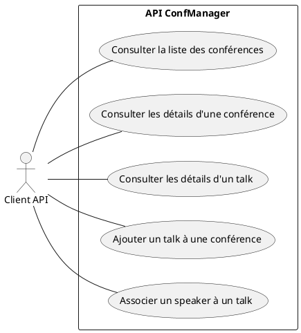
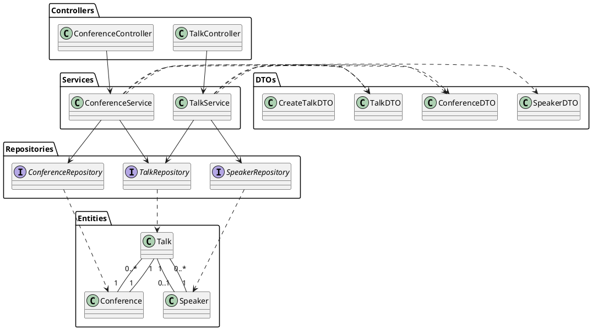
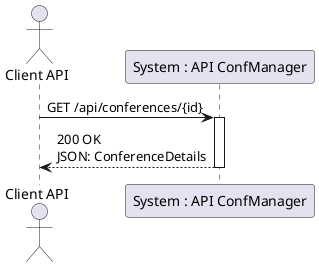
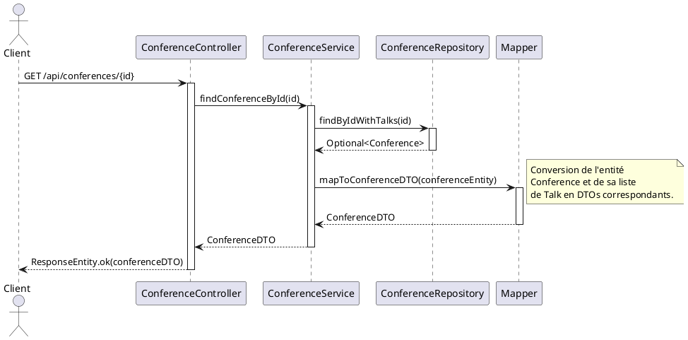

# Projet 

### 1. Énoncé du Projet : API "ConfManager"

**Objectif :** Développer une API REST pour gérer les informations d'une petite conférence technique. L'API doit permettre de consulter les conférences, leurs sessions (talks), et les intervenants (speakers) associés. Elle doit également permettre d'ajouter de nouvelles sessions et d'y assigner des intervenants.

**Périmètre pour 1 journée :**
*   Consulter les conférences et leurs détails.
*   Consulter les sessions et leurs détails.
*   Ajouter une nouvelle session à une conférence existante.
*   Associer un intervenant existant à une session.

---

### 2. Besoins Fonctionnels

*   **B-1 :** Lister toutes les conférences disponibles.
*   **B-2 :** Obtenir les détails d'une conférence spécifique, y compris la liste de ses sessions.
*   **B-3 :** Obtenir les détails d'une session (talk) spécifique, y compris son intervenant (speaker).
*   **B-4 :** Créer une nouvelle session et l'associer à une conférence existante.
*   **B-5 :** Mettre à jour une session pour lui assigner un intervenant.

---

### 3. Fichiers de Départ (à créer par le développeur)

#### Entités JPA

1.  **Conference.java**
    *   `id` (Long)
    *   `name` (String)
    *   `startDate` (LocalDate)
    *   `endDate` (LocalDate)
    *   `location` (String)
    *   `talks` (`List<Talk>`) - Association `@OneToMany`

2.  **Talk.java**
    *   `id` (Long)
    *   `title` (String)
    *   `description` (String)
    *   `startTime` (LocalDateTime)
    *   `conference` (Conference) - Association `@ManyToOne`
    *   `speaker` (Speaker) - Association `@ManyToOne`

3.  **Speaker.java**
    *   `id` (Long)
    *   `firstName` (String)
    *   `lastName` (String)
    *   `bio` (String)
    *   `talks` (`List<Talk>`) - Association `@OneToMany`

#### Fichier d'hydratation `data.sql` (pour H2)

```sql
-- Speakers
INSERT INTO speaker (id, first_name, last_name, bio) VALUES
(1, 'James', 'Gosling', 'Le père de Java.'),
(2, 'Gavin', 'King', 'Créateur de Hibernate.');

-- Conferences
INSERT INTO conference (id, name, start_date, end_date, location) VALUES
(10, 'Devoxx France 2024', '2024-04-17', '2024-04-19', 'Paris'),
(11, 'Spring I/O 2024', '2024-05-30', '2024-05-31', 'Barcelone');

-- Talks
-- Talk sans speaker assigné au début
INSERT INTO talk (id, title, description, start_time, conference_id, speaker_id) VALUES
(100, 'Introduction to Project Loom', 'Découvrez les virtual threads en Java.', '2024-04-17T10:00:00', 10, NULL),
(101, 'Deep Dive into Spring Boot 3', 'Nouveautés et bonnes pratiques.', '2024-05-30T11:00:00', 11, 2);
```

---

### 4. Diagrammes UML (Format PlantUML)

#### Diagramme de Cas d'Utilisation



#### Diagramme de Classe (Architecture)



#### Diagramme de Séquence Système (Ex: Consulter les détails d'une conférence)



#### Diagramme de Séquence Détaillé (Ex: Consulter les détails d'une conférence)


---

### 5. User Stories

#### User Story 1 : Consulter les détails d'une conférence

*   **Titre :** US-01 - Vue détaillée d'une conférence
*   **En tant que** client de l'API,
*   **Je veux** récupérer les informations détaillées d'une conférence spécifique, y compris la liste de ses sessions,
*   **Afin de** pouvoir afficher un programme complet.

*   **Critères d'Acceptance :**
    *   **Scénario 1 (Succès) :**
        *   **Etant donné** qu'une conférence avec l'ID `10` existe dans le système.
        *   **Quand** j'envoie une requête `GET` à `/api/conferences/10`.
        *   **Alors** je reçois une réponse avec le statut `200 OK`.
        *   **Et** le corps de la réponse contient les détails de la conférence (nom, dates, lieu) et une liste JSON de ses talks.
    *   **Scénario 2 (Échec) :**
        *   **Etant donné** qu'aucune conférence avec l'ID `99` n'existe.
        *   **Quand** j'envoie une requête `GET` à `/api/conferences/99`.
        *   **Alors** je reçois une réponse avec le statut `404 Not Found`.

*   **Découpage Technique :**
    1.  **DTO :** Créer `TalkSummaryDTO` (id, title) et `ConferenceDetailDTO` (id, name, ..., `List<TalkSummaryDTO>`).
    2.  **Repository :** Créer une méthode dans `ConferenceRepository` pour récupérer une conférence avec ses talks (ex: `findByIdWithTalks`).
    3.  **Service :** Implémenter `findConferenceById(Long id)` dans `ConferenceService`. La méthode doit appeler le repository, gérer le cas `Optional.empty()` (en lançant une exception `ResourceNotFoundException`), et mapper l'entité vers le `ConferenceDetailDTO`.
    4.  **Controller :** Créer l'endpoint `GET /api/conferences/{id}` dans `ConferenceController` qui appelle le service et retourne une `ResponseEntity`.
    5.  **Exception Handling :** Mettre en place un `@ControllerAdvice` pour intercepter `ResourceNotFoundException` et la transformer en réponse `404`.

#### User Story 2 : Ajouter un talk à une conférence

*   **Titre :** US-02 - Ajout d'une session
*   **En tant que** client de l'API,
*   **Je veux** pouvoir créer une nouvelle session (talk) et l'associer à une conférence existante,
*   **Afin de** construire le programme de l'événement.

*   **Critères d'Acceptance :**
    *   **Scénario 1 (Succès) :**
        *   **Etant donné** qu'une conférence avec l'ID `10` existe.
        *   **Quand** j'envoie une requête `POST` à `/api/conferences/10/talks` avec un corps JSON valide contenant le titre, la description et l'heure de début du talk.
        *   **Alors** je reçois une réponse avec le statut `201 Created`.
        *   **Et** le corps de la réponse contient les détails du talk nouvellement créé.
        *   **Et** le nouveau talk est bien associé à la conférence `10` en base de données.
    *   **Scénario 2 (Échec - Conférence inexistante) :**
        *   **Etant donné** qu'aucune conférence avec l'ID `99` n'existe.
        *   **Quand** j'envoie une requête `POST` à `/api/conferences/99/talks`.
        *   **Alors** je reçois une réponse avec le statut `404 Not Found`.

*   **Découpage Technique :**
    1.  **DTO :** Créer `CreateTalkDTO` (title, description, startTime) pour le corps de la requête. Créer `TalkDetailDTO` pour la réponse.
    2.  **Service :** Implémenter `addTalkToConference(Long conferenceId, CreateTalkDTO createTalkDTO)` dans `TalkService`.
        *   Vérifier que la conférence existe via `ConferenceRepository`. Si non, lancer `ResourceNotFoundException`.
        *   Créer une nouvelle entité `Talk` à partir du DTO.
        *   Associer la conférence à ce talk.
        *   Sauvegarder le talk via `TalkRepository`.
        *   Mapper l'entité sauvegardée vers `TalkDetailDTO` et la retourner.
    3.  **Controller :** Créer l'endpoint `POST /api/conferences/{conferenceId}/talks` dans `TalkController`. Il doit appeler le service et retourner une `ResponseEntity` avec le statut `201` et le DTO du talk créé.

---

### 6. Planning de Réalisation (1 Journée)

#### **1/4 Journée (Matin 1) : Initialisation et Endpoints de Lecture Simples** (2h)

*   **Objectif :** Mettre en place la structure et voir des données à l'écran.
*   **Tâches :**
    1.  Mise en place du projet Spring Boot avec les dépendances (`web`, `data-jpa`, `h2`, `lombok`).
    2.  Copier/coller les entités JPA, `application.properties` et `data.sql`.
    3.  Créer les 3 repositories (`Conference`, `Talk`, `Speaker`).
    4.  Implémenter le **cas d'usage B-1 : Lister toutes les conférences**.
        *   Créer `ConferenceSummaryDTO`.
        *   Créer `ConferenceService` et `ConferenceController`.
        *   Implémenter `GET /api/conferences`.
    5.  Lancer et tester l'endpoint via `curl` ou Postman.

#### **2/4 Journée (Matin 2) : Endpoints de Lecture Détaillés** (2h)

*   **Objectif :** Gérer les relations et les DTOs imbriqués.
*   **Tâches :**
    1.  Implémenter le **cas d'usage B-2 : Détails d'une conférence**.
        *   Créer `ConferenceDetailDTO` avec une `List<TalkSummaryDTO>`.
        *   Implémenter `GET /api/conferences/{id}`.
        *   Mettre en place la gestion de l'exception `ResourceNotFoundException` (`@ControllerAdvice`).
    2.  Implémenter le **cas d'usage B-3 : Détails d'un talk**.
        *   Créer `SpeakerDTO` et `TalkDetailDTO` (qui contient un `SpeakerDTO`).
        *   Implémenter `GET /api/talks/{id}`.

#### **3/4 Journée (Après-midi 1) : Endpoints d'Écriture** (2h)

*   **Objectif :** Implémenter la logique de création et de mise à jour.
*   **Tâches :**
    1.  Implémenter le **cas d'usage B-4 : Ajouter un talk à une conférence**.
        *   Créer `CreateTalkDTO`.
        *   Implémenter `POST /api/conferences/{conferenceId}/talks`.
        *   Gérer le cas où la conférence n'existe pas.
    2.  Implémenter le **cas d'usage B-5 : Associer un speaker à un talk**.
        *   Implémenter un endpoint `PATCH /api/talks/{talkId}/speaker/{speakerId}`.
        *   Le service devra vérifier l'existence du talk et du speaker avant de faire l'association.

#### **4/4 Journée (Après-midi 2) : Finalisation et Validation** (2h)

*   **Objectif :** Nettoyer, valider et s'assurer que tout fonctionne.
*   **Tâches :**
    1.  **Validation des entrées :** Ajouter des annotations de validation (`@Valid`, `@NotBlank`, etc.) sur les DTOs d'entrée (`CreateTalkDTO`) et gérer les `MethodArgumentNotValidException` pour retourner des erreurs `400 Bad Request`.
    2.  **Tests :** Passer en revue tous les endpoints avec Postman/curl pour vérifier les cas nominaux et les cas d'erreur (ID invalide, corps de requête incorrect...).
    3.  **Refactoring :** Revoir le code, optimiser les imports, s'assurer que la conversion Entité <-> DTO est propre (via MapStruct ou des mappers manuels).
    4.  **Documentation :** Rédiger un `README.md` simple expliquant comment lancer l'API et décrivant les endpoints disponibles.